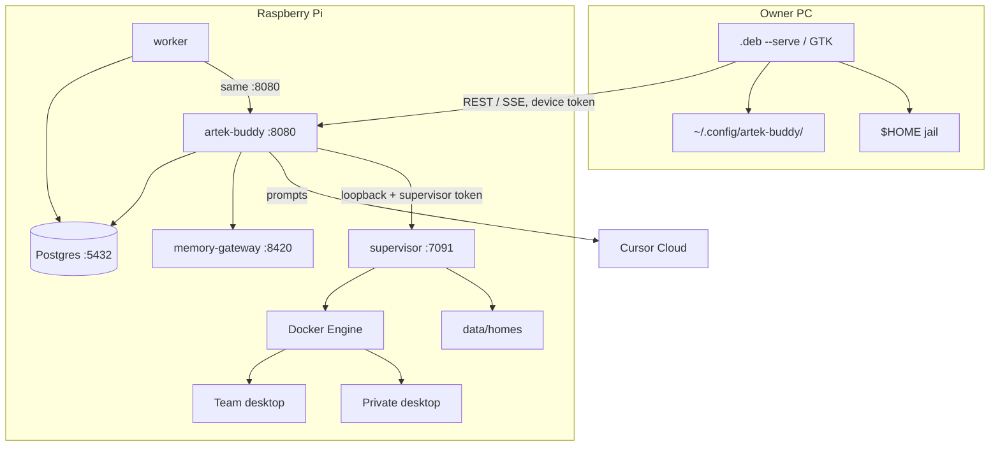
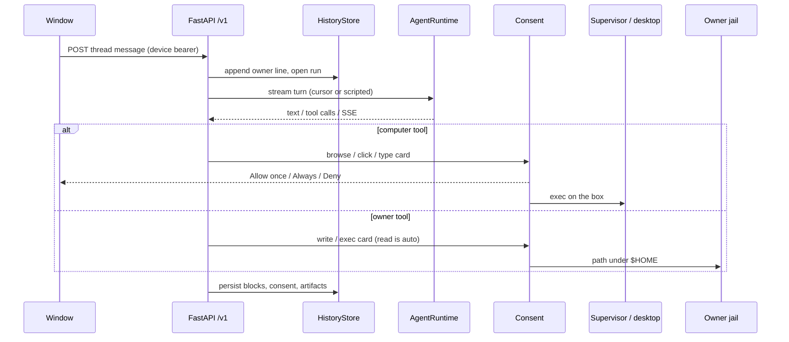

# Architecture

This is the running Compose stack on one Raspberry Pi, not a target diagram.
Trade-offs: [adr/](adr/). Trust and residual risk: [THREAT-MODEL.md](THREAT-MODEL.md).

The HTTP API is the product. The `.deb` is the first client. Cursor Cloud is
the only live model runtime.

## Processes

Compose services (`docker-compose.yml`): host API, worker, supervisor,
memory gateway, Postgres. The computer *image* is built from
`infra/computer`; boxes are created at runtime by the supervisor, not as a
long-running compose service.

`network_mode: host` on API, worker, supervisor, and memory-gateway.
Postgres is published `127.0.0.1:5432`. Supervisor listens `127.0.0.1:7091`.
Desktop noVNC ports bind `127.0.0.1`. The API default is `HTTP_HOST=0.0.0.0`.

## Where state lives

| State | Where |
| --- | --- |
| Threads, bots, devices, pairing hashes, memory book, routines, consent, artifacts | Postgres (`HistoryStore`, 15 SQL files under `src/artek_buddy/db/migrations/`). Host API and worker both call `apply_migrations` on boot; a session `pg_advisory_lock` serializes them. Each applied file stores a sha256; a rewritten historical file fails the run. |
| Chromium profile, downloads, sandbox home | `data/homes/{home_key}` on the Pi |
| Optional memory index files | `data/agent-memory` via the loopback gateway |
| Host token, DB password, Cursor key | Pi `.env` (never in the page) |
| Device token, remembered URL | Owner PC `~/.config/artek-buddy/` |
| Model weights / turn execution | Cursor Cloud; prompts leave the Pi |

Idle desktops sleep; `RestartPolicy: no`. Reset deletes that home. Team reset
wipes the shared home for every Team bot.

## A turn

Handlers live under `src/artek_buddy/` and call `HistoryStore` plus
`ComputerService`. They do not grow a second persistence layer. The window
talks HTTP through `client/web/src/api.ts`. Window types wrap the generated
schema in `client/web/src/generated/openapi.d.ts` (dumped at build/CI from
`app.openapi()`). Implemented RPC rows:
`src/artek_buddy/contracts/rpc.py`. OpenAPI is off at runtime
(`docs_url=None`, `openapi_url=None`).

## Test pyramid

| Layer | Job | What it is |
| --- | --- | --- |
| Lint / types / audit | `quality` | Ruff, mypy, pip-audit |
| Unit + API | `backend` | pytest `tests/unit tests/api tests/client`, Postgres service, `AGENT_RUNTIME=scripted`, `SANDBOX_PROVIDER=fake`, coverage fail-under 71% plus higher floors on auth/jail/migrations/supervisor write, `npm run check` |
| Packaged window | `ui` | Playwright against an **installed** `.deb --serve` |
| Model canary | `live` | Opt-in (`CURSOR_API_KEY`); real computer image; Cursor runtime |

Do not treat `ui` as “the host unit tests in a browser”. Computer image is
not built in `release.yml` (QEMU Chromium hangs); `live` builds it on
`ubuntu-latest`.

## What this is not

No Kubernetes, no Redis, no second model vendor, no `services/` +
`repositories/` rewrite. Those are rejected on purpose — see the ADRs.
