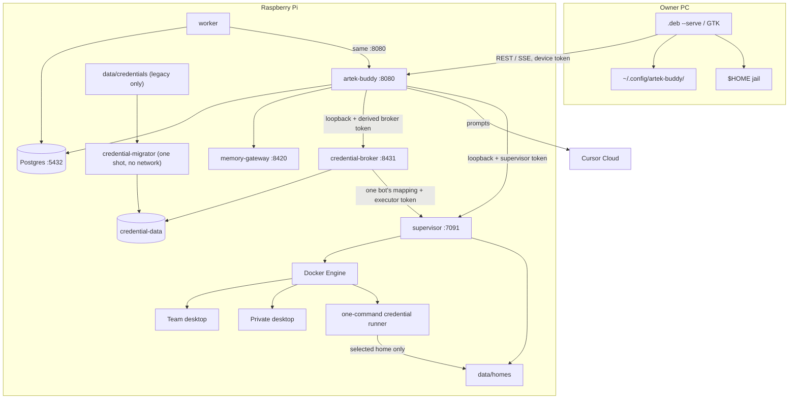
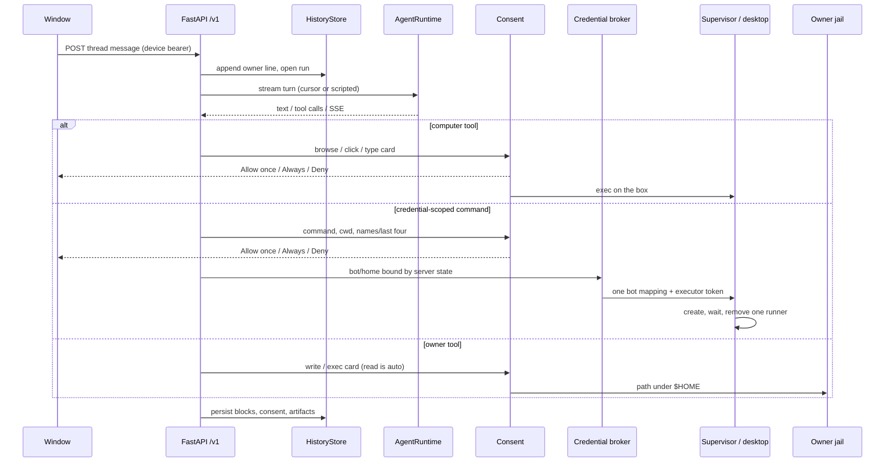

# Architecture

This is the running Compose stack on one Raspberry Pi, not a target diagram.
Trade-offs: [adr/](adr/). Trust and residual risk: [THREAT-MODEL.md](THREAT-MODEL.md).

The HTTP API is the product. The `.deb` is the first client. Cursor Cloud is
the only live model runtime.

## Processes

Compose services (`docker-compose.yml`): host API, worker, supervisor,
memory gateway, credential broker, Postgres, plus a
one-shot credential migrator. The computer *image* is built from
`infra/computer`; boxes are created at runtime by the supervisor, not as a
long-running compose service. Credential commands use the same host image in
one-command runner containers; runners are not Compose services.

`network_mode: host` on API, worker, supervisor, memory-gateway, and credential
broker. The broker binds only `127.0.0.1:8431`; its bearer is domain-separated
from `AGENT_HTTP_TOKEN`. Broker execution dispatches to a supervisor route on
`127.0.0.1:7091` with a second domain-separated bearer; the regular supervisor,
host, and broker bearers do not authenticate that route. The migrator has
`network_mode: none`, sees the legacy credential directory and the new named
volume, and exits after confirmed copies. It retries three times; the API stays
blocked if plaintext cannot be confirmed and removed. A rerun never overwrites
an existing broker value: it removes the legacy copy after same-value
confirmation or preserves a different broker value and removes the stale copy.
Symlink bot directories are skipped.

Only the broker and migrator mount `credential-data`; neither mounts homes.
The supervisor mounts app data because it already manages desktops, but it
passes one resolved `data/homes/{home_key}` bind—not the homes tree—to each
credential runner. The runner is on outbound-capable `artek-computers` with
inter-container communication disabled. It drops all capabilities, enables
no-new-privileges, uses a read-only root, bounded tmpfs, memory, CPU, PID,
timeout, and output, runs `/bin/sh -c` without a login profile, and is forcibly
removed after success, timeout, or failure. The Docker request asks for a
256 MiB memory cgroup; a hard 2 GiB process address-space ceiling keeps the
runner bounded on Pi kernels where Docker reports no memory-controller support
while still allowing the Go-based `gh` CLI to reserve its virtual arena. `gh`
and `uv` are pinned in the host image used by the runner.
Postgres is published `127.0.0.1:5432`. Supervisor listens `127.0.0.1:7091`.
Desktop noVNC ports bind `127.0.0.1`. The API default is `HTTP_HOST=0.0.0.0`.

## Where state lives

| State | Where |
| --- | --- |
| Threads, bots, devices, pairing hashes, memory book, routines, consent, artifacts | Postgres (`HistoryStore`, 26 SQL files under `src/artek_buddy/db/migrations/`). Host API and worker both call `apply_migrations` on boot; a session `pg_advisory_lock` serializes them. Each applied file stores a sha256; a rewritten historical file fails the run. |
| Chromium profile, downloads, sandbox home | `data/homes/{home_key}` on the Pi |
| Per-bot GitHub, PyPI, and named tokens | Broker-owned SQLite in Docker named volume `credential-data`; the API, worker, supervisor, Postgres, desktop boxes, and credential runners do not mount it |
| Optional memory index files | `data/agent-memory` via the loopback gateway |
| Host token, DB password, Cursor key | Pi `.env` (never in the page) |
| Device token, remembered URL | Owner PC `~/.config/artek-buddy/` |
| Model weights / turn execution | Cursor Cloud; prompts leave the Pi |

Idle desktops sleep; `RestartPolicy: no`. Reset deletes that home. Team reset
wipes the shared home for every Team bot.

## A turn

Handlers live under `src/artek_buddy/` and call `HistoryStore` plus
`ComputerService`. They do not grow a second persistence layer. The window
talks HTTP through `client/web/src/api.ts`. Window types wrap the generated
schema in `client/web/src/generated/openapi.d.ts` (dumped at build/CI from
`app.openapi()`). Implemented RPC rows:
`src/artek_buddy/contracts/rpc.py`. OpenAPI is off at runtime
(`docs_url=None`, `openapi_url=None`).

## Test pyramid

| Layer | Job | What it is |
| --- | --- | --- |
| Lint / types / audit | `quality` | Ruff, mypy, pip-audit |
| Unit + API | `backend` | pytest `tests/unit tests/api tests/client`, Postgres service, `AGENT_RUNTIME=scripted`, `SANDBOX_PROVIDER=fake`, coverage fail-under 71% plus higher floors on auth/jail/migrations/supervisor write, `npm run check` |
| Packaged window | `ui` | Playwright against an **installed** `.deb --serve` |
| Model canary | `live` | Opt-in (`CURSOR_API_KEY`); real computer image; Cursor runtime |

Do not treat `ui` as “the host unit tests in a browser”. Computer image is
not built in `release.yml` (QEMU Chromium hangs); `live` builds it on
`ubuntu-latest`. Privileged publish is `workflow_dispatch` on `main` after a
green push `test` and CodeQL on that SHA — not a default-branch
`workflow_run`.

Plugins Connect and `connect_app` send a host-owned https callback
(`CONNECTIONS_CALLBACK_URL`). A caller `redirect_url` is ignored.

## What this is not

No Kubernetes, no Redis, no second model vendor, no `services/` +
`repositories/` rewrite. Those are rejected on purpose — see the ADRs.
