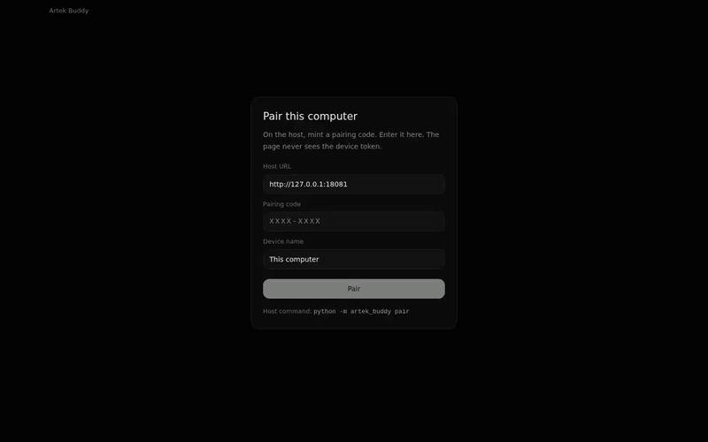
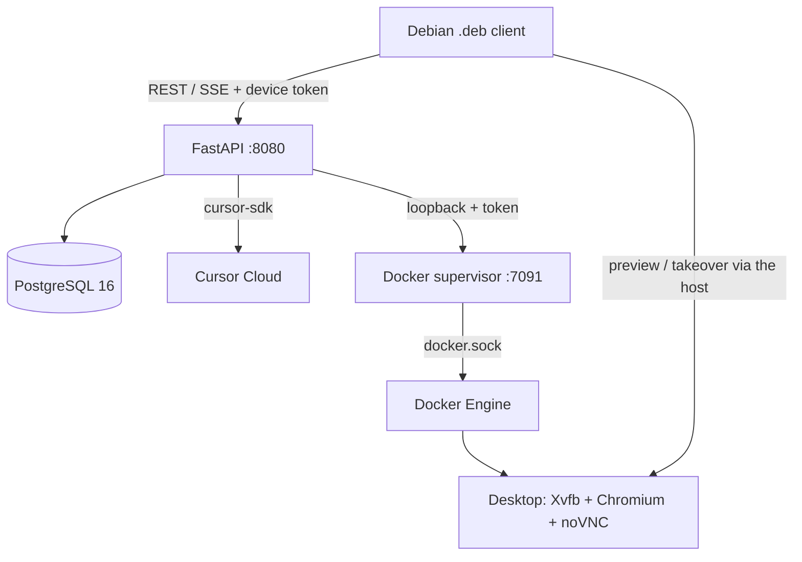

# Artek Buddy

[](https://github.com/itsuppartem/artek-buddy/actions/workflows/test.yml)
[](https://github.com/itsuppartem/artek-buddy/releases/latest)
[](LICENSE)

Self-hosted **AI agent host** for a Raspberry Pi: isolated Linux computer-use sandboxes, a Debian `.deb` client, FastAPI + Postgres, and **your** Cursor quota (`cursor-sdk` → Grok / Composer). Not a hosted Grok bot and not a vendor cloud VM.

Python 3.13 · FastAPI · PostgreSQL 16 · Docker · Xvfb / Chromium / noVNC · React / TypeScript · Playwright · GitHub Actions · Tailscale · Apache-2.0

**What this repo actually builds**

- Per-bot Linux desktops on the Pi (shared **Team** box or **Private** container), with persistent homes
- Capability consent in the thread (Allow once / Always / Deny) before the agent browses, clicks, or writes on this PC
- Tests against **Postgres** and a **scripted** model runtime; an opt-in job hits the real Cursor/Grok catalog
- CI installs the same packaged `.deb` the owner installs — not a Vite dev server
- Multi-arch host images on GHCR (`linux/amd64`, `linux/arm64`); GitHub Releases attach the client `.deb`, `SHA256SUMS`, CycloneDX SBOMs, and provenance after `test` on that `main` SHA is green
- Pairing issues a **device token**; `AGENT_HTTP_TOKEN` and the Docker socket stay on the Pi

Shipped versions: [CHANGELOG.md](CHANGELOG.md).

## Demo

Pair the Linux window, ask a question, answer the bot’s card, reply in the thread, and watch Chromium open Wikipedia on the Pi desktop.



## Architecture

| Part | Responsibility |
| --- | --- |
| Raspberry Pi host | FastAPI `:8080`, Postgres history and memory, optional loopback memory index `:8420`, cron worker, and the Docker supervisor |
| Agent runtime | Cursor Cloud through `cursor-sdk`; default model is `grok-4.6`, configurable in `.env` |
| Bot desktop | A graphical Linux container with Xvfb, Chromium, view-only VNC, and temporary user takeover |
| Linux client | Pairing, bot list, live thread, notifications, memory/routine controls, and computer preview |



Daily access is a Tailscale tailnet (free Personal plan is enough). Compose uses `network_mode: host` and the API default is `HTTP_HOST=0.0.0.0`, so `:8080` is reachable on every host interface the kernel has. Do not port-forward it. Funnel is optional and **publishes the whole API** — read step 6 before turning it on.

Trust boundary, pairing, `docker.sock`, and residual risk: [THREAT-MODEL.md](THREAT-MODEL.md). Processes, state, turn flow, and the test pyramid: [ARCHITECTURE.md](ARCHITECTURE.md). Decisions: [adr/](adr/). How to report a vuln: [SECURITY.md](SECURITY.md).

## Why this exists

Most chat assistants are good at answering one request, but poor at being a long-lived personal worker: they lose context, cannot keep a task-specific desktop, and usually require you to adopt another account, quota, or hosted environment.

Artek Buddy combines an always-on Pi with the Cursor models you already pay for. It is for people who want a practical agent available from their own computer: one that can retain explicitly saved context, run scheduled work, use a disposable Linux desktop, and ask for help when a human decision or takeover is needed.

The result is **your Cursor key, your model quota, your Pi, and your client**. The HTTP API is the product; Cursor Cloud is the only live model runtime. There is no second model provider login.

> Conversations, bot settings, memory, schedules, and desktops are hosted on the Pi. Prompts and relevant context still go to Cursor Cloud to run the selected model; this is not an offline model.

If you searched for a self-hosted Grok bot, a Cursor agent host, or computer-use on a Raspberry Pi — this is that stack.

## What you can do today

- **Keep separate agents for separate responsibilities.** Create bots for research, recurring monitoring, coding or operations tasks, or a personal assistant. Each bot has an independent thread, profile, memory, schedule, and desktop mode.
- **Give an agent a real Linux workspace.** A bot can open URLs and local paths, launch or close graphical apps, inspect its screen, and interact with a Chromium desktop on this Pi. Opening a website, filling a form, clicking, or typing shows **Allow once / Always / Deny** in the thread and does not run until you answer. You can watch the view-only preview or take control when the agent needs you to complete a login, CAPTCHA, payment, or other human-only step. **Team** bots share one desktop; **Private** gives that bot its own container — see below.
- **Let an agent work on this Linux PC like SSH.** After you pair the `.deb`, it can read a file or list a folder under your home without a card. Writing a file or running a command that can change the PC asks **Allow once / Always / Deny** once for that bot — Always covers later writes and commands on this PC. Read-only shell (`ls`, `cat`, `echo`, …) does not ask. The host token never appears in the page. This is not a VNC of the laptop.
- **Run work without keeping your laptop on.** The Pi runs the host continuously. Routine prompts run on a cron schedule; unused desktops sleep after about 15 minutes. Take control returns to the bot after two idle minutes.
- **Retain useful context from chat.** Talk normally — name, tone, paths, a standing ban. The bot writes those into a book (no profile form). A later fact revises the chapter instead of stacking a contradiction. The next turn already has the owner book and this chat's standing rules. Work notes come back when the turn is about that work. The Memory panel can show the same book.
- **Keep a published skill for this chat.** Ask the bot to find a skill on the public web and keep it. Allow that origin; the stored document is the fetched markdown, not a paraphrase. On a matching task the agent opens the skill itself. Internal steps and controls do not clutter the owner chat. That is not a memory fact and not a routine.
- **Attach a catalog app from chat.** Ask to connect GitHub (or Docs). The bot searches Plugins and starts Connect. It does not mint a git token on the Pi. After Connect, that app's tools are already on this turn; the bot calls them itself. There is no chip above Message.
- **Work on more than one thing at a time.** A lead agent can create workers for distinct tasks, show their progress in the chat, and stop, restart, or steer a worker when requirements change. A message sent while a lead is working is injected at the next tool (like Codex steer / Grok follow-up). If nothing is left to inject, it runs as a follow-up after the turn.
- **Use a chat that can ask back.** When a browser or site needs one concrete human step, the agent posts an option or free-text question and waits. Your answer returns to the same run so it can continue instead of starting the task again. Completed answers stay on the card.
- **Attach a file or a screenshot to the next send.** Plus, drop, or Ctrl+V. Copying a file on this PC (not only a screenshot) attaches the file — not the path as text. Images, video, and audio show a preview in the composer before you press Enter. The host copies them into that bot’s `inbox/`. Deleting the chat removes that chat’s inbox copies; a shared Team home and other bots’ files stay.
- **Open the sandbox home on the desktop.** Take control, then right-click → **Files**. The computer pane is screen, memory, and routines — not a second file list.
- **Download a file the agent made.** The bot posts a file card in the thread. Pictures, video, and audio show a preview there. Download opens the system Save dialog (Downloads / Загрузки by default). The copy stays on the Pi with that chat.
- **Use the same agent from your Linux PC securely.** Pair the desktop window once over Tailscale. The client holds a device token; the Pi's host token and Docker access never leave the Pi.

Typical uses include: a morning briefing routine, a research bot that opens sources on its desktop after you Allow the site, a project assistant that remembers repository conventions, a bot that reads a notes file from your PC, a long-running task delegated to workers, or a desktop automation task where you take over only for the final human step.

### Team vs Private computer

This is not “your PC vs someone else’s”. Both modes are Linux desktops **on this Raspberry Pi**. Chat, memory, and routines are already per-bot either way. The switch only chooses the desktop box.

| Mode | What is created | When to use |
| --- | --- | --- |
| **Team** (default) | One shared container `artek-bot-team-{workspace}` and one home `data/homes/team-{workspace}`. Every Team bot attaches to that same box. If one bot is using it, another Team bot waits. | Daily bots that can take turns on one Chromium. Light on RAM. |
| **Private** | A **new** container `artek-bot-{bot_id}` and a **new** home `data/homes/{bot_id}`. Cookies, downloads, and the open windows stay on that bot. It can run at the same time as the Team desktop (and other Private bots). | A bot that must keep its own browser session, or run while another bot is already on the shared box. Costs a second desktop on the Pi. |

Create-bot and Edit profile both have the Team / Private control. Changing the mode rebinds the bot to the other computer row; it does not copy the old home. Idle boxes sleep; starting a Private bot that has never booted provisions its container then.

The home stays on the Pi disk (`data/homes/{home_key}`). Rebooting the Pi, Stop, or Restart does **not** wipe Chromium logins or downloads. The box does not auto-start after a host reboot (`RestartPolicy: no`); the next boot reuses the same home. **Reset** in Bot Settings destroys the container and deletes that home. Team reset wipes the shared desktop for every Team bot.

## Boundaries

- Artek Buddy is a personal, self-hosted system, not a multi-tenant SaaS or a replacement for a managed browser-automation platform.
- The computer sandbox is isolated from your laptop, but it is still a capable Linux environment. Give bots only the access and instructions you are comfortable delegating.
- Model output can be wrong and browser workflows can fail. Review important results and take control for sensitive or irreversible actions.
- The shipped client is Linux-only today. The host API is independent of that client, so other clients can be built later.

## Where things run

| Piece | Machine | You install |
| --- | --- | --- |
| Host stack (API, Postgres, supervisor, worker, computer image) | Raspberry Pi (or any Linux box you leave on) | Docker + Compose, `.env`, Tailscale |
| `.deb` | GitHub Release, or a local build | Release: a browser. Local: Node 22, `dpkg-deb` |
| `.deb` **install** + daily window | Debian / Ubuntu PC | The package + Tailscale. Pairing talks to the Pi |

## Bring it up

You need: a Cursor account with an active subscription, Docker + Compose on the Pi, Tailscale on the Pi and on the owner PC (the **free Personal plan is enough**), and a Debian/Ubuntu PC for the window.

### 1. Cursor API key

The host is not the Cursor IDE. It calls Cursor Cloud with a **user API key**. Team Admin keys do not work with the SDK yet.

1. In the Cursor app: click your **account / profile** (top right) → **Dashboard**. Or open [cursor.com/dashboard/api](https://cursor.com/dashboard/api) in a browser and sign in with the same account.
2. Open **API Keys**.
3. **New API Key**. Name it something like `artek-buddy-pi`.
4. Copy the key **now**. You will not see it again. It starts with `crsr_`.

Keep that key on the Pi only. Never commit it.

### 2. Choose a model

The key’s catalog is account-specific. This repo defaults to Grok because that quota is separate from the main Cursor models and otherwise sits idle.

| `.env` | Default | Meaning |
| --- | --- | --- |
| `CURSOR_MODEL` | `grok-4.6` | Model id from Cursor’s catalog |
| `CURSOR_MODEL_EFFORT` | `xhigh` | Reasoning effort when the model supports it |
| `CURSOR_MODEL_FAST` | `true` | Prefer the fast variant when one exists |

After the host is up, list what **this key** can actually run:

```bash
TOKEN=$(grep AGENT_HTTP_TOKEN .env | cut -d= -f2)
curl -s -H "Authorization: Bearer $TOKEN" http://127.0.0.1:8080/v1/models
```

Put one of those `id` values in `CURSOR_MODEL`, or pick the model in **Models** after pairing. The host no longer requires a key at boot.

Common ids you may see: `grok-4.6`, `composer-2.5`, `auto-smart` (Cursor Router, if your team allows it). Do not guess — use the list above.

### 3. Host on the Raspberry Pi

One action after Docker is installed. The script writes `.env` with random tokens and starts the stack. A provider key is not required to boot: pair the window and paste a key in **Models**, or set `CURSOR_API_KEY` in `.env` to seed Cursor. Paste a key in **Plugins**, or set `COMPOSIO_API_KEY` to seed that host key.

```bash
sudo apt-get update
sudo apt-get install -y git docker.io docker-compose-v2 curl
sudo usermod -aG docker "$USER"   # then log out and back in
curl -fsSL https://github.com/itsuppartem/artek-buddy/releases/latest/download/install-host.sh | sh
```

A second run against a newer tag updates a **clean** checkout to that tag and keeps `.env`. Uncommitted files abort; set `ARTEK_HOME` to an empty directory instead of overwriting.

Optional: edit `~/artek-buddy/.env` and set `CURSOR_API_KEY=crsr_…` if you want Cursor seeded from env, or `COMPOSIO_API_KEY` for the Plugins key. For a real app login, set `CONNECTIONS_CALLBACK_URL` to this host's HTTPS origin (the same Funnel / tailnet URL the window uses). The window can add or replace keys later.

Manual clone and `docker compose up --build` still work. After the first GHCR publish, set each package visibility to **Public** so the Pi can pull without login.

On the Pi (this machine), the long form:

```bash
git clone https://github.com/itsuppartem/artek-buddy.git
cd artek-buddy
cp .env.example .env
```

Edit `.env` (the file is gitignored):

```bash
CURSOR_API_KEY=crsr_your_key_here
AGENT_HTTP_TOKEN=$(openssl rand -hex 24)
# paste the printed token into AGENT_HTTP_TOKEN=
CURSOR_MODEL=grok-4.6
CURSOR_MODEL_EFFORT=xhigh
CURSOR_MODEL_FAST=true
MEMORY_DB_PASSWORD=$(openssl rand -hex 16)
```

`AGENT_HTTP_TOKEN` stays on the Pi. The desktop window never gets it. Devices pair and receive their own token.

If you already run an older compose stack, add `MEMORY_DB_PASSWORD` to `.env` (use the password Postgres was created with) before the next `docker compose up`. Rebuild `artek-buddy-computer:local`, then stop and boot each desktop so boxes pick up CapDrop / resource limits and the isolated `artek-computers` network.

Build the desktop box image once, then start the stack:

```bash
docker compose --profile build build computer
docker compose up -d --build
curl -s http://127.0.0.1:8080/health
```

You want `{"ok": true, ...}`. Logs if it is not:

```bash
docker compose logs -f artek-buddy
```

A bad or missing key, or a model id that is not in the catalog, shows up there at boot.

### 4. Reach the Pi over Tailscale

The owner PC talks to this Raspberry Pi on a Tailscale tailnet. That is the daily path. You do not open LAN ports and you do not need a paid Tailscale plan.

The **free Personal plan** is enough: one always-on Pi, one or a few owner PCs, MagicDNS if you want a name instead of an IP. Funnel (public HTTPS) is optional, on that plan, and **exposes the whole host API** — see step 6 before you turn it on.

1. Install Tailscale on the Pi and on the desktop PC: [tailscale.com/download](https://tailscale.com/download).
2. Sign in with the same account (or any tailnet both machines belong to).
3. On the Pi:

```bash
sudo tailscale up
tailscale ip -4
```

The host URL from another PC is `http://<that-ip>:8080`. If MagicDNS is on, `http://<pi-hostname>:8080` works too.

Keep the tailnet IP and Funnel hostname out of git.

### 5. Install the Linux `.deb`

**Usual path:** a GitHub Release. A merge into `main` that bumps `VERSION` attaches `artek-buddy-client_<version>_all.deb` (no baked host URL), `SHA256SUMS`, CycloneDX SBOMs, and `install-host.sh` only after `test` and CodeQL on **that commit** are green and `release.yml` is dispatched from that `main` SHA (not a `workflow_run` loaded from `develop`). Dispatch refuses an existing VERSION tag or GitHub Release (`force` cannot skip). The Release tag is that SHA. GHCR `latest` moves only after that GitHub Release exists. The host image is scanned before `latest` moves. GitHub Releases are not pruned by that workflow.

Verify a downloaded Release:

```bash
sha256sum -c SHA256SUMS
gh attestation verify artek-buddy-client_0.10.27_all.deb --repo itsuppartem/artek-buddy
gh attestation verify oci://ghcr.io/itsuppartem/artek-buddy:0.10.27 --repo itsuppartem/artek-buddy
```

Attestations exist on Releases published after this landed. Older tags have checksums only. The computer image is **not** built in Actions (QEMU Chromium hangs); `install-host.sh` builds it on the Pi when GHCR has no tag.

The `test` workflow **builds and installs** a `.deb` to run Playwright; it does **not** upload that artifact. Do not commit `*.deb`.

Download the package from the [latest Release](https://github.com/itsuppartem/artek-buddy/releases/latest).

| Step | Where | What you need |
| --- | --- | --- |
| Mint a pairing code | **Pi** (running stack) | `docker exec artek-buddy python -m artek_buddy pair` — 15 minutes, one use |
| Get the package | GitHub Release, or a local build | Release: a browser. Local: Node 22, `git`, `npm`, `dpkg-deb` |
| Install the package | **Debian / Ubuntu owner PC** | `python3`, GTK, WebKit (pulled by `apt`) |

Local build (unreleased tree, or a baked host URL):

```bash
# Node 22+ on PATH (this Pi keeps a local install under ~/.local/node)
client/build-deb.sh
```

Local builds stay in the repo root (gitignored). Copy the file to the desktop PC.

On the desktop PC:

```bash
# From Downloads, use dpkg. `apt install ./…` often fails because `_apt`
# cannot read the home directory.
sudo dpkg -i artek-buddy-client_0.10.27_all.deb
sudo apt-get install -f
```

`apt-get install -f` pulls: `python3`, `python3-gi`, `gir1.2-gtk-3.0`, WebKitGTK, `gir1.2-ayatanaappindicator3-0.1`, `gir1.2-notify-0.7`, `xdg-utils`, and `libnotify-bin`.

Upgrade later with a newer `.deb` of a **different version** (`dpkg -i` the new file). Do not overwrite the same filename in the repo when you bump `VERSION`. Remove with `sudo apt-get remove artek-buddy-client`. Pairing files stay in `~/.config/artek-buddy/` until you delete them.

Release packages leave the pair URL empty. `ARTEK_BAKE_URL=1 client/build-deb.sh` can copy untracked `client/url` into a local package only. Never put a token in that file.

Open **Artek Buddy** from the app menu (or `artek-buddy`).

The installed client stays available through its **Artek Buddy** tray indicator after the window is closed. Use **Open Artek Buddy** to present it again or **Quit** to stop it. On GNOME, the shell must have StatusNotifier/AppIndicator support enabled; if the indicator is not connected, closing the window exits instead of hiding it invisibly. Background replies, questions, and takeover also stay in the Ubuntu notification list as **Artek Buddy** while the client is running.

1. Host URL — `http://<pi-tailscale-ip>:8080` from the owner PC (step 4). Use `http://127.0.0.1:8080` only if the window runs on the Pi itself.
2. Pairing code from the `pair` command on the Pi.
3. Device name (this computer).
4. **Pair**.

The window stores `~/.config/artek-buddy/{token,url}` (mode `600`). Then: **+** to create a bot, type in the composer, Shift+Enter for a new line, Enter to send. More client notes: [client/README.md](client/README.md).

### 6. Optional public HTTPS (Tailscale Funnel)

Daily use is the tailnet URL from step 4. Funnel publishes `:8080` to the
public internet (`https://<your-machine>.ts.net`). Screen URLs now require
a Bearer token, but **every other host route is on that hostname too**.
Do not Funnel until you have a strong `AGENT_HTTP_TOKEN`, pairing
rate-limits are enough for you, and you accept that a leaked device token
is a public credential.

```bash
sudo tailscale funnel --bg 8080
```

Put that URL in the Linux `.deb` (`client/url` or the pair form), or open the
same URL in a phone browser. The host now serves the window there. Pair with a
code. On iPhone: Share → Add to Home Screen, open that icon, then pair and
Turn on alerts. Alerts work while that home-screen app is open; iOS will not
run this page in the background or after you swipe it away. This-PC file tools
stay on the Linux `.deb` — the phone cannot read the phone's files. **Never
commit the hostname.** Prefer the tailnet URL unless you truly need the public
one.

## Day to day

| Task | Command |
| --- | --- |
| Health | `curl -s http://127.0.0.1:8080/health` |
| New pairing code | `docker exec artek-buddy python -m artek_buddy pair` |
| Rebuild after a pull | `docker compose up -d --build` |
| Change model | edit `CURSOR_MODEL` in `.env`, then `docker compose up -d` |
| Host logs | `docker compose logs -f artek-buddy` |
| Client log | `~/.config/artek-buddy/client.log` |

The worker (`artek-buddy-worker`) wakes due routines through the same `threads.send` path. No extra GUI.

## Version

`0.10.27` — one number, see `VERSION`. License: [Apache-2.0](LICENSE). How to contribute: [CONTRIBUTING.md](CONTRIBUTING.md) (work on `develop`; `main` is pull-request only). How to report a vuln: [SECURITY.md](SECURITY.md).

Do not commit secrets, packaged clients (`*.deb`), `data/`, `docs/`, Funnel hostnames, local compose (`docker-compose.local.yml`), or local tooling.

## CI (GitHub only)

**CI tests the packaged `.deb` and the host web page separately.** The `ui` job builds the Debian package, installs it, and drives `--serve`. The `ui_web` job opens the host `:8080` page at iPhone 11 Pro size (375×812) and does not install a `.deb`.

Tests run in Actions on pull requests into `develop` and `main`, and on pushes to those branches (`workflow_dispatch` still works). They do **not** run on this Pi and must not use the live `:8080` stack or owner Postgres.

| Job | What |
| --- | --- |
| `quality` | Ruff format + lint, mypy (baseline codes), pip-audit. No Postgres. |
| `backend` | same Ruff/mypy, then pytest host + HTTP API (`AGENT_RUNTIME=scripted`) + `.deb` proxy unit tests + coverage + `npm audit` (high) + Biome + Vitest + `tsc` |
| `scan` | Trivy filesystem (CRITICAL/HIGH, ignore unfixed). Image scan is on `release.yml` after the host image push (CRITICAL, ignore unfixed). |
| `ui` | always. Built `.deb` + `--serve` against a scripted host (no Cursor key). Pairing, boot/thread errors, sidebar, bots, memory, routines, scripted chat / fail / consent |
| `ui_web` | always. Host page at iPhone 11 Pro (375×812), no `.deb`. Pair, Chats / Chat / Desktop, scripted send, This-PC cut |
| `live` | only if `CURSOR_API_KEY` is set. Same `.deb`, real computer image, Grok turns (reply + Allow/Deny browse) |
| `live_web` | only if `CURSOR_API_KEY` is set. Host page at iPhone 11 Pro, one Grok reply |

`ui` is the merge gate for the window. `live` is a canary: Grok can flake without hiding a broken shell. Fork pull requests do not see the secret, so `live` is skipped there.

The repository is public. Workflows never `echo` secrets, never dump `env`, never run `docker compose config`, and never upload `.env`, client logs, or Playwright traces. Generated host/DB tokens are `::add-mask::`’d. Failure logs pass through `infra/ci-redact-logs.sh`.

Add one repository secret: **`CURSOR_API_KEY`** (Settings → Secrets and variables → Actions). Same key/model as the Pi. Do not put the key in the workflow file, in `GITHUB_OUTPUT`, or in a commit.

## License

Artek Buddy is licensed under the [Apache License 2.0](LICENSE).

The HTTP contract surface — nouns (`bots`, `threads`, `runs`, `memory`, `routines`, `computers`), procedure names, and run/event status vocabulary — was **adapted from** [elie222/rakazo](https://github.com/elie222/rakazo) (Apache License 2.0). See [NOTICE](NOTICE).

Artek Buddy is not a port of that TypeScript monorepo. The host (Python / FastAPI / Cursor runtime), the Linux `.deb` client, bot colors, and the bandicoot mascot (desktop icon and bot avatars) are original. The wire uses `snake_case`. Sandboxes run only on this Raspberry Pi.
