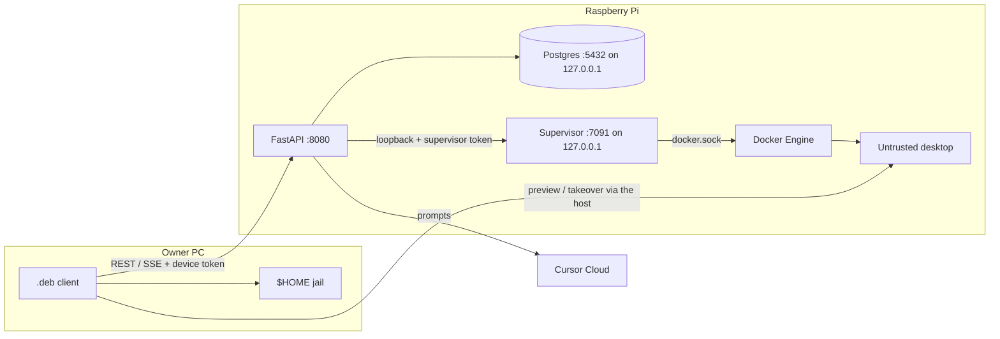

# Threat model

A reviewer should be able to answer **what is trusted, what is not, and what
remains open** from this page. Residual risk is named on purpose.

How to report a vuln: [SECURITY.md](SECURITY.md).

## What is trusted

- The Raspberry Pi: kernel, Docker Engine, host API container, worker,
  supervisor, Postgres, optional memory gateway.
- The owner’s paired Linux `.deb` (device token on that PC).
- Cursor Cloud as the live model runtime (prompts and relevant context leave
  the Pi).

The host API process is trusted-equivalent to the Pi. A Cursor agent inside
that container that can `printenv` is not a product bug ([SECURITY.md](SECURITY.md)).

## What is not trusted

- Bot desktop containers (Xvfb / Chromium / noVNC). They are the agent’s
  environment, not the owner PC.
- Model output and anything the model puts in a tool call.
- Recalled memory text used as *instructions* (the host marks it as data).
- Any client that can reach `:8080` without a valid bearer (LAN, Funnel, a
  leaked token).

Owner `$HOME` is reachable only through the paired `.deb` jail, not from the
desktop container.

## Diagram

`AGENT_HTTP_TOKEN` and `docker.sock` stay on the Pi. Pairing mints a **device
token** for the window. The supervisor bearer is derived from the host token
(or `SANDBOX_SUPERVISOR_TOKEN`) and is **not** interchangeable with
`AGENT_HTTP_TOKEN`.

## Bind story (`:8080`)

Today the API listens on **every interface the kernel has**:

| Knob | Value |
| --- | --- |
| Compose | `network_mode: host` |
| Settings | `HTTP_HOST` default `0.0.0.0` (`config.py`, compose `HTTP_HOST: 0.0.0.0`) |
| Supervisor | `SUPERVISOR_HOST=127.0.0.1`, port `7091` |
| Postgres | published `127.0.0.1:5432` |
| Memory gateway | `127.0.0.1:8420` |
| Desktop noVNC | host ports bound `127.0.0.1` (random high ports) |

Tailscale is **policy**, not a bind. MagicDNS / a tailnet IP is how the owner
PC is supposed to reach `:8080`. Nothing in the process restricts listen to
the Tailscale interface. A LAN neighbor, a leaked Funnel hostname, or
`0.0.0.0` plus a router forward all see the same FastAPI.

This issue does **not** change `HTTP_HOST`. Stronger options, if we take them
later: bind to the tailnet address, a host firewall that only allows the
tailnet, or Tailscale **Serve** instead of Funnel. Funnel still publishes the
**whole** host API (`README` step 6). `/novnc` URLs need a Bearer; every other
route on that hostname does too, including pairing and tokens.

OpenAPI is off at runtime (`docs_url=None`, `openapi_url=None` in `main.py`).

## Table

| Asset | Threat | Boundary | Mitigation | Residual |
| --- | --- | --- | --- | --- |
| `AGENT_HTTP_TOKEN` | Stolen or placeholder token drives bots, memory, routines, sandboxes | Host HTTP | Reject empty/placeholder at boot; `secrets.compare_digest`; pairing mint is host-only | Anyone who can call `:8080` with this token *is* the host. Funnel or LAN makes theft remote. |
| Device token (`dev_…`) | Stolen `~/.config/artek-buddy/token` | Owner PC + host HTTP | CSPRNG `token_urlsafe`; files mode `600`; missing bearer 401, bad token 403 | A leaked device token is a full API credential. Funnel makes it a public credential. |
| Pairing code | Online guess / replay | Host HTTP | 8 chars from a 32-symbol alphabet, 15‑minute TTL, hashed at rest, 8 failures / 5 min per client | Limiter is in-memory (resets on host restart). Host token still mints codes. |
| Supervisor token / `:7091` | Call create/exec/remove as the supervisor | Loopback HTTP | Listen `127.0.0.1`; separate derived bearer; host token must not work on `:7091` | Compare is string equality, not `compare_digest`. Process on the Pi that can hit loopback and the token owns Docker via the supervisor. |
| `docker.sock` on the supervisor | Container breakout = root on the Pi | Unix socket mount | Only the supervisor container gets the socket; desktops do not | The supervisor **is** root-equivalent. A bug in that process is a host compromise. |
| Untrusted desktop | Agent breakout, lateral movement, noisy neighbors | Container + `artek-computers` network | `CapDrop: ALL`; `no-new-privileges`; 1536 MiB / 1 CPU / 512 pids; tmpfs `/tmp`; `enable_icc=false`; noVNC on `127.0.0.1`; capability consent in the thread | **Still root in the box.** Live browse canary (`test_browse_allow_starts_chromium`) saw no `chromium` process after Allow as uid 1000. Chromium stderr is inside the box, not compose logs. Chromium uses `--no-sandbox --disable-setuid-sandbox`. Rootfs is writable. No gVisor. |
| Funnel / public HTTPS | Whole API on the internet | Tailscale Funnel | Documented as optional and dangerous; `/novnc` Bearer | Funnel is not “safe HTTPS for the window”. It is a public bind of `:8080`. |
| Model prompt injection | Recalled notes or page text treated as orders | Host → Cursor Cloud | Memory wrapped as data, not instructions (`format_recalled_memory`); browse/click/write wait on Allow/Deny | The model is outside the Pi. Injection can still request tools; consent is the brake, not a parser. |
| Desktop breakout | Escape to the Pi or another bot | Engine + network | Isolated compose network, ICC off, CapDrop ALL, host token never in the page | Root in the desktop, `--no-sandbox` Chromium, writable rootfs, Docker socket on the supervisor, shared Team home. |
| Owner `$HOME` | Read/write/exec outside the home | Paired `.deb` | `inspect_owner_path` jail under the owner home; write/exec consent per bot | Jail is the **logical** path then `resolve()`. Symlinks and bind mounts on the owner PC are a residual. Auto owner-read of files still happens without a card. |
| Postgres | Remote SQL, weak password | Host network | Port published `127.0.0.1:5432` only; password from `.env` | `network_mode: host` on the API still talks to that port. Placeholder DB passwords are an operator miss. |
| GHCR / Release `.deb` | Supply-chain swap | GitHub + Actions | Release only after green `test` on that `main` SHA; `SHA256SUMS`; Actions pinned by commit SHA; CodeQL / pip-audit / Trivy | No SBOM/attestations yet (#92). Starlette/pytest audit exceptions are listed in `.github/pip-audit-ignore.txt`. Computer image is **not** built in Actions. |
| `CURSOR_API_KEY` | Leak in Actions logs or the window | Actions secret + host env | `ui` job does not get the key; workflows must not `echo` env / `docker compose config` | Live canary needs the secret. A workflow edit that prints env is a leak. |

## Open by design

1. `:8080` on `0.0.0.0` + `network_mode: host`. Tailscale is how you *should* reach it, not how the socket is bound.
2. Funnel = public API. Do not treat it as a pairing-only portal.
3. Desktop boxes drop all capabilities and have Pi 5-sized memory/CPU/pids limits. They stay **root**: uid 1000 did not start Chromium in the live canary. They are not a kernel jail: Chromium is `--no-sandbox`, the rootfs is writable, and there is no gVisor.
4. `docker.sock` on the supervisor is required for this product shape; the threat is “supervisor bug = Pi root”, not “we forgot the socket”.
