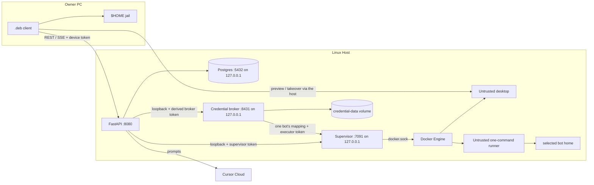

# Threat model

A reviewer should be able to answer **what is trusted, what is not, and what
remains open** from this page. Residual risk is named on purpose.

How to report a vuln: [SECURITY.md](SECURITY.md).

## What is trusted

- The Linux host: kernel, Docker Engine, host API container, worker,
  supervisor, credential broker and one-shot migrator,
  Postgres, optional memory gateway.
- The owner’s paired Linux `.deb` (device token on that PC).
- Cursor Cloud as the live model runtime (prompts and relevant context leave
  the host).

The host API process is trusted-equivalent to the host. A Cursor agent inside
that container that can `printenv` is not a product bug ([SECURITY.md](SECURITY.md)).

## What is not trusted

- Bot desktop containers (Xvfb / Chromium / noVNC) and one-command credential
  runners. They are agent environments, not the owner PC.
- Model output and anything the model puts in a tool call.
- Recalled memory text used as *instructions* (the host marks it as data).
- Any client that can reach `:8080` without a valid bearer (LAN, Funnel, a
  leaked token).

Owner `$HOME` is reachable only through the paired `.deb` jail, not from the
desktop container.

## Diagram

`AGENT_HTTP_TOKEN` and `docker.sock` stay on the host. Pairing mints a **device
token** for the window. The supervisor bearer is derived from the host token
(or `SANDBOX_SUPERVISOR_TOKEN`) and is **not** interchangeable with
`AGENT_HTTP_TOKEN`. The credential-broker bearer is independently derived
(or `CREDENTIAL_BROKER_TOKEN`) and the raw host bearer does not authenticate
to `:8431`. Broker-to-execution calls use another independently derived bearer
(or `CREDENTIAL_EXECUTOR_TOKEN`) on a dedicated supervisor route; neither the
host bearer, regular supervisor bearer, nor broker bearer authenticates that
route. Both internal HTTP listeners bind loopback only. A trusted process that
has `AGENT_HTTP_TOKEN` can derive these internal tokens; blank `CREDENTIAL_*`
overrides are not a security boundary.

## Protocol and Seam Boundaries

The host communicates with runtimes and sandbox supervisor processes via strict interfaces (`AgentRuntime` and `ComputerGateway` / `SupervisorGateway`):
- Untrusted desktop containers and one-command runners never receive the Docker socket or supervisor credentials. All control flows through `SupervisorGateway`.
- Handlers check capability flags (`RuntimeCapabilities`, `ComputerCapabilities`) rather than `isinstance` checks, preventing type-sniffing or unintended privilege creep across different runtime environments.
- Error reporting enforces explicit categorization (`unavailable`, `timeout`, `cancelled`, `exhausted`, `transient`, `permanent`) and guarantees secret redaction via `safe_message` before exceptions reach HTTP responses, structured logs, or the owner window.

## Bind story (`:8080`)

Today the API listens on **every interface the kernel has**:

| Knob | Value |
| --- | --- |
| Compose | `network_mode: host` |
| Settings | `HTTP_HOST` default `0.0.0.0` (`config.py`, compose `HTTP_HOST: 0.0.0.0`) |
| Supervisor | `SUPERVISOR_HOST=127.0.0.1`, port `7091`; credential execution has a distinct bearer |
| Postgres | published `127.0.0.1:5432` |
| Memory gateway | `127.0.0.1:8420` |
| Credential broker | `127.0.0.1:8431`; authenticated operations only |
| Desktop noVNC | host ports bound `127.0.0.1` (random high ports) |

Tailscale is **policy**, not a bind. MagicDNS / a tailnet IP is how the owner
PC is supposed to reach `:8080`. Nothing in the process restricts listen to
the Tailscale interface. A LAN neighbor, a leaked Funnel hostname, or
`0.0.0.0` plus a router forward all see the same FastAPI.

This issue does **not** change `HTTP_HOST`. Stronger options, if we take them
later: bind to the tailnet address, a host firewall that only allows the
tailnet, or Tailscale **Serve** instead of Funnel. Funnel still publishes the
**whole** host API (`README` step 6). `/novnc` HTTP and the screen WebSocket
need a Bearer or the host-page `artek_device` cookie; every other
route on that hostname does too, including pairing and tokens.

OpenAPI is off at runtime (`docs_url=None`, `openapi_url=None` in `main.py`).
CI dumps `app.openapi()` into `client/web/openapi.json` for TypeScript types;
that file is not served.

## Table

| Asset | Threat | Boundary | Mitigation | Residual |
| --- | --- | --- | --- | --- |
| `AGENT_HTTP_TOKEN` | Stolen or placeholder token drives bots, memory, routines, sandboxes | Host HTTP | Reject empty/placeholder at boot; `secrets.compare_digest`; pairing mint is host-only | Anyone who can call `:8080` with this token *is* the host. Funnel or LAN makes theft remote. |
| Device token (`dev_…`) | Stolen `~/.config/artek-buddy/token` or the host page cookie | Owner PC / phone browser + host HTTP | CSPRNG `token_urlsafe`; files mode `600`; cookie is `HttpOnly` + `SameSite=Lax` (Secure on HTTPS); missing bearer 401, bad token 403; host token in a cookie is ignored; open SSE re-checks that `device_id` is unrevoked and the member is active, not only membership | A leaked device token is a full API credential until revoke. Funnel makes it a public credential. The phone cookie is that token. Heartbeats can lag one frame after revoke. |
| Host-served window | Funnel visitor sees pairing + `/v1` | Host HTTP | Pairing code; cookie auth; `/local/owner-*` on the host is 403; HTML gets CSP (`frame-ancestors 'none'`), `X-Content-Type-Options: nosniff`, `Referrer-Policy: no-referrer`. Host-page `/local/*` same-origin uses Origin vs Host, and `X-Forwarded-Host` / `X-Forwarded-Proto` only when the peer is loopback (Funnel to `:8080`). Pair refreshes the process nonce from `/local/status` before consume. | The page is the API origin. CSP does not replace cookie auth. This-PC tools stay on the Linux `.deb`. iOS home-screen alerts only fire while that app is open unless we later add Web Push. A local process can spoof forwarded host/proto. |
| Pairing code | Online guess / replay | Host HTTP | 8 chars from a 32-symbol alphabet, 15‑minute TTL, hashed at rest, 8 failures / 5 min per client | Limiter is in-memory (resets on host restart). Host token still mints codes. |
| Supervisor tokens / `:7091` | Call create/exec/remove or dispatch credential execution | Loopback HTTP | Listen `127.0.0.1`; regular supervisor and credential-execution routes use different derived bearers; raw host and broker bearers are rejected; `secrets.compare_digest` | A trusted process with the host token can derive both. A process with either matching token reaches root-equivalent Docker orchestration exposed by that route. Client 500s are generic. |
| `docker.sock` on the supervisor | Container breakout = root on the host | Unix socket mount | Only the supervisor container gets the socket; desktops do not | The supervisor **is** root-equivalent. A bug in that process is a host compromise. |
| Untrusted desktop | Agent breakout, lateral movement, noisy neighbors | Container + `artek-computers` network | `CapDrop: ALL`; `no-new-privileges`; 1536 MiB / 1.5 CPU / 512 pids; tmpfs `/tmp` (`noexec`); `enable_icc=false` on create; an existing network with ICC on is deleted when unused or refused when boxes are attached; noVNC on `127.0.0.1`; capability consent in the thread | **Still root in the box.** Live browse canary (`test_browse_allow_starts_chromium`) saw no `chromium` process after Allow as uid 1000. Chromium stderr is inside the box, not compose logs. Chromium uses `--no-sandbox --disable-setuid-sandbox`. Rootfs is writable. No gVisor. Fluxbox is started from `/usr`, not a script on `/tmp`. A host that already has live boxes on a permissive `artek-computers` will not start until those boxes are stopped. The guest Chromium profile default-allows geolocation, notifications, clipboard, and media so site chrome does not block the bot; that is not the owner's laptop sensors. |
| Funnel / public HTTPS | Whole API on the internet | Tailscale Funnel | Documented as optional and dangerous; `/novnc` Bearer or device cookie; host HTML CSP / nosniff / no-referrer; pairing Origin matches the public name only via loopback-forwarded headers | Funnel is not “safe HTTPS for the window”. It is a public bind of `:8080`. Headers do not replace that. |
| Model prompt injection | Recalled notes or page text treated as orders | Host → Cursor Cloud | Owner book and work notes stay data (`<owner_book>`, `<work_notes>`). Bot book (`<bot_book>`) is standing instructions this host saved for that chat. Playbook names sit in `<skill_books>`; the steps enter only after `open_book`. A fetched skill is untrusted instructions (same class as page text); Allow/Deny on that origin is the brake. A reply from another inbox bot is that bot's last message only, not their thread. Browse/click/write wait on Allow/Deny | Owner book, an installed skill, and another bot's last message can still try to jailbreak. Consent is the brake. Charter is trusted because it was written on this host, not scraped from a page. The model is outside the host; injection can still request tools. |
| Bot-authored chat link | A deceptive or malformed URL replaces the `.deb` shell or launches an unsafe handler | Thread → owner browser | Links require an explicit owner click. The WebKit navigation policy keeps the loopback shell in place and launches only absolute external `http(s)` without URL credentials. Link context actions use the same validation; Copy URL has a local clipboard fallback. | A valid `http(s)` page can still be phishing or malicious. The system browser and its profile enforce the remaining boundary. |
| Host fetch of a skill URL | `install_book` aimed at loopback, RFC1918, link-local, or cloud metadata | Host HTTP client | Scheme http/https only; no userinfo; resolve every address and refuse loopback / private / link-local / CGNAT / metadata; do not follow redirects. Scripted tests may fetch one in-process fixture URL. | DNS can rebind between the check and the GET (TOCTOU). Residual: treat fetched markdown as untrusted, same as page text. |
| Desktop breakout | Escape to the host or another bot | Engine + network | Isolated compose network, ICC off, CapDrop ALL, host token never in the page | Root in the desktop, `--no-sandbox` Chromium, writable rootfs, Docker socket on the supervisor, shared Team home. |
| Owner `$HOME` | Read/write/exec outside the home | Paired `.deb` | `inspect_owner_path` jail under the owner home; write/exec consent per bot **and answering device**. Always from one paired window does not skip the card on another. Lookup with no turn device matches only host-wide grants (`device_id` NULL), not any device's row. `git` and `find` are mutating unless they match an inspect-only argv (no `--output`, config, or worktree-changing flags; `git branch` is list-only). The paired `.deb` refuses git/find file-output targets outside `$HOME` before `shell=True`. | Jail checks the logical path and then `resolve()`; symlinks escaping the owner home are denied. CodeQL `py/path-injection` on that join is accepted residual, not a forgotten traversal. Bind mounts on the owner PC remain a residual. Auto owner-read of files still happens without a card. Command strings after Allow are still a shell; that residual is named below. A worker started from that Deb turn inherits the Deb device so Always still covers its This-PC jobs. Inbox follow-ups without a stored actor fail closed (host-wide grants only). |
| Owner job delivery | A stale id, reconnect, or two windows executes the wrong write/command twice or lets the losing window fail the winner's work | Host ↔ paired `.deb` | Request ids stay on the current call stack; a new client atomically ACK-claims queued work and must return its private claim nonce with the result; a losing client stands down; Postgres stores lifecycle but not command/file content; terminal jobs reject late results; host restart fails leftover queued/acked jobs instead of replaying them and shows a check or new-attempt card | An old client that does not ACK remains compatible and cannot prevent two old windows from performing the same side effect while the host stays up. The claim nonce is process-local. Restart does not restore a lost command payload. |
| Owner question resume | Another client answers a blocked agent, answers twice, or injects a secret into the resumed model call | Host ↔ paired client ↔ Cursor | Pairing/device auth is required; the answer must match the pending bot, run, and message; parked ask/consent waits are stored in Postgres; the first answer closes the card and later answers return conflict; after restart a parked wait without a started side effect stays answerable and continues as a follow-up turn; the lead is told not to request passwords | The follow-up is a new turn, not a restored Cursor tool stack. A paired client for this host can answer any visible pending question. |
| SSH ControlMaster socket | Another local process attaches to or stops a reused SSH connection | Owner PC | Explicit `~/.config/artek-buddy/ssh-mux` opt-in; dedicated `%C` path in a `0700` directory; bounded `ControlPersist`; wrapper affects only owner-exec and does not write keys or `~/.ssh/config` | A process running as the same owner can access the session. A killed client may leave a socket until OpenSSH expires it. Absolute `/usr/bin/ssh` bypasses the wrapper. |
| Fresh-session resume brief | Stale or injected remembered text becomes a command, or a secret is repeated to the model | Host → Cursor Cloud | Only bounded existing facts and visible bot text; env/bearer/home redaction; tagged as reference data; says tool history is unavailable and mutable state must be verified; sent once to a fresh lead session | The model still sees path/branch/constraint text and can follow a malicious remembered line. Redaction is pattern-based, not a complete data-loss-prevention system. |
| Loopback `/local/*` RPC | Another page on this PC calls owner-exec / pair / unpair | Paired `.deb` HTTP | Mutating calls: required Origin matching the window; Host; reject `Sec-Fetch-Site: cross-site`; JSON Content-Type; size cap; process nonce (`hmac.compare_digest`). `GET /local/status` may omit Origin; wrong Origin or `cross-site` is still 403. | A process on the owner PC that can hit loopback can read the nonce from status. `shell=True` owner-exec remains. The optional SSH wrapper inherits the owner environment and agent socket. |
| Desktop notification / tray | Bot text appears on a lock screen, or close hides the only window behind an unavailable indicator | Paired `.deb` → owner desktop session | Notification title/body are clipped; replied/failed honor `notifyOnFinish`; libnotify / `notify-send` receive structured fields, not a shell string. Close-to-tray is allowed only when AppIndicator reports `connected`; otherwise close exits normally. | Questions and takeover always alert. The desktop notification policy decides lock-screen visibility, and a malicious bot reply can still put deceptive text in a notification. |
| Postgres | Remote SQL, weak password | Host network | Port published `127.0.0.1:5432` only; password from `.env`. Host and worker migrate on boot under `pg_advisory_lock`; applied files store sha256 and a rewritten historical file fails the run. | `network_mode: host` on the API still talks to that port. Placeholder DB passwords are an operator miss. |
| GHCR / Release `.deb` | Supply-chain swap | GitHub + Actions | Privileged `release.yml` is not loaded via default-branch `workflow_run`. Publish is `workflow_dispatch` on `main`; the job prints `workflow_sha` / `released_sha` / `test_sha`, requires them equal, on `main`, a green push `test` on that SHA, and completed successful CodeQL jobs on that SHA (`analyze (python)`, `analyze (javascript-typescript)`, plus a successful `codeql` workflow run). GitHub does not post the PR check named `CodeQL` on `main` pushes. Bind prints `check_run_id` and `codeql_run_id` for that SHA and refuses a missing or red `codeql` workflow run. An existing VERSION tag or GitHub Release aborts before registry login; `force` cannot skip that. Workflow `concurrency` serializes dispatch without cancel-in-progress. Host image Trivy HIGH/CRITICAL on the digest; GHCR `VERSION` / `latest` move only after `gh release create`. No `--clobber`; Releases are not pruned by the default workflow; `SHA256SUMS`; CycloneDX SBOM of the packaged `.deb` and host image; GitHub Artifact Attestations; Actions pinned by commit SHA; pip-audit / Trivy | pytest-only pip-audit ignores (not in the host image) are listed in `.github/pip-audit-ignore.txt` with a reason and expiry. Host-image HIGH that we cannot bump yet are listed in `.trivyignore`: cursor-sdk vendors undici 5.29.0 (CVE-2026-12151, CVE-2026-1526, CVE-2026-2229; the host Node bridge talks to Cursor Cloud over TLS); gh 2.99.0 vendors golang.org/x/mod v0.39.0 (CVE-2026-56864, CVE-2026-56865; runtime `gh` is not a Go module client); the official python:3.13-slim SBOM still lists setuptools 70.3.0 (CVE-2025-47273) and msgpack 1.1.2 (GHSA-6v7p-g79w-8964) on the language row while site-packages is already patched. Revisit when those upstreams pin a patched copy. Computer image is **not** built in Actions. A digest that fails Trivy is still in GHCR until GC, untagged as `latest`. Dispatch from `develop` is skipped by the job `if`. The Release tag is created at the tested `main` SHA and peeled before GHCR `VERSION` / `latest` move; `gh release create` uses `--verify-tag` so a missing tag is not taken from default `develop`. If `imagetools` fails after that Release exists, `force` cannot retry; an emergency republish is a separate GitHub Environment, not `force`. |
| `CURSOR_API_KEY` | Leak in Actions logs or the window | Actions secret + host env | `ui` job does not get the key; workflows must not `echo` env / `docker compose config` | Live canary needs the secret. A workflow edit that prints env is a leak. |
| Provider keys in Postgres | Stolen DB dump or a verbose log line | Host Postgres on loopback | Keys stay on the host; `GET /v1/models/credentials` returns last four only; connect body is not logged; `observe` redacts env `CURSOR_API_KEY` | A process that can read Postgres on the host owns every pasted key. Forget clears the row; an env seed recreates Cursor only when no Cursor row exists. |
| Bot authorization tokens | App `/data`, Postgres, another bot, a chat paste, command output, or a log/resume line exposes a token | Loopback credential broker + dedicated `credential-data` volume + disposable runner | Only broker/migrator mount the named volume; neither mounts homes. Metadata-only APIs have no secret read operation. Server state binds bot/home; the worker supplies only command/cwd. Every command requires the credential-exec consent class (Allow once / Always / Deny). The broker sends one bot's mapping over loopback to the distinct-auth supervisor route. The supervisor creates one runner with only that resolved home, `env -i` minimal shell env, `sh -c` (not login shell), outbound `artek-computers` with ICC off, CapDrop ALL, no-new-privileges, read-only root, bounded tmpfs, Docker 256 MiB memory request plus hard 2 GiB address-space fallback, CPU/PIDs/time/output, then force-removes the whole container. Supervisor redacts injected values before returning; broker redacts every stored value again. Chat intake strips before history; Forget/delete call broker. The no-network migrator uses insert-if-missing, confirms new inserts, never overwrites a different broker value, skips symlink bot directories, removes stale legacy copies, and blocks startup after bounded retries on failure. | Broker SQLite is plaintext mode `0600` in a root-only `0700` volume (`py/clear-text-storage-sensitive-data`). Host root/broker compromise owns it. For one approved command, plaintext crosses loopback and is transiently visible to the root-equivalent Docker daemon in create payload/container metadata and to the runner environment until forced removal. The supervisor mounts all app data itself, though each runner receives one home only. On kernels without Docker memory-controller support, the 2 GiB virtual-address ceiling is weaker than a 256 MiB cgroup RSS limit. Cwd joins remain a named residual (`py/path-injection`). The approved command is arbitrary shell (`py/command-line-injection`) and can legitimately spend, transmit, encode, print, or write its token; exact-value redaction is not an exfiltration control. A Docker/supervisor failure can delay cleanup. Tokens already in old history should be rotated. |
| Connected-app key in Postgres | Stolen DB dump, a verbose error, or a tool result that repeats the key | Host Postgres on loopback | `GET /v1/connections/status` returns last four only; errors strip the key; logs redact a broker key if it is also in the process env; `observe` redacts env `COMPOSIO_API_KEY` | A process that can read Postgres on the host owns the pasted key. An env seed writes the key only when no key exists yet. Catalog names and tool text from a connected app are untrusted, same class as owner-book injection. `connect_app` can put a third-party login URL on a thread card; the owner opens it. The host sends a fixed https callback (`CONNECTIONS_CALLBACK_URL`); a caller `redirect_url` is ignored. |
| Host logs | Token, pairing code, or home path in a log line | Host / worker / supervisor / credential broker | JSON in Docker; `request_id` on HTTP, `threads.send`, and tool lines; redact bearer, configured env secrets, pairing, `/novnc`, `/home/<user>`; broker/supervisor request bodies are not logged; runner streams are bounded and exact-value redacted at supervisor and broker boundaries before product logs/results | Docker itself transiently sees runner env and unredacted output. Encoded/transformed output evades exact-value redaction. Do not log bodies or screenshots. Funnel still makes a stolen device/host token remote. |
| Audit chain integrity | Compromised client or unauthorized caller modifies membership, grants, or consent history | Audit chain in Postgres | Cryptographic sha256 hash chaining (seq + event_type + actor + resource + canonical_payload + prev_hash); secret scrubbing; atomic transactional append with advisory locking; verification CLI (`artek-buddy audit-verify`) | Tamper-evident against compromised client devices and API callers. Does NOT protect against an operator or attacker who can execute arbitrary `UPDATE audit` directly in Postgres as the host DB superuser (residual: DB writer). |
| Activity log payloads | Tokens, tool args, or screenshots land in the durable SSE replay table | Postgres `activity` | Same-transaction append after key-drop + `redact_text`; no tool args, tokens, or image bytes | A DB reader still sees product-visible message ids and grant metadata. Activity is not an audit hash chain; retention is a count bound, not a legal hold. |
| Search FTS | Rank/limit after fetch leaks a hidden high-rank row; snippet HTML; tool args indexed | Postgres `search_documents` | Authorized `resource_id = ANY(...)` in SQL before `ts_rank`, headline, and limit. Non-owner is deny-by-default until grants. GIN is not RLS. Headlines are escaped plaintext. Tool, progress, plugin, and computer blocks are not indexed. Query length, token count, result size, and `statement_timeout` are capped. | A DB reader sees indexed title/body. Empty vs unauthorized is the same page (`hits` + `has_more`, no total). Grants (#157) are not in the tree. |
| Automations | Duplicate trigger fires twice; an edit mutates an in-flight run; a guest enables a prompt; approval is only an in-memory Event | Postgres `automations` / `automation_runs` + jobs | Owner-only create/edit/run. Each trigger event has a unique `idempotency_key`. The run stores a definition snapshot. Approval is an ask block plus a durable run row; `/answer` resumes from Postgres after a host restart. Dry-run does not enqueue or call tools. Dangerous tools still use consent cards. | Team @mentions and multi-user approval are not in this slice. Cron still advances `next_run_at` before the HTTP wake (same residual as routines). |
| Per-turn token usage | Stolen token sees spend counts and the estimated USD; a log line repeats a prompt | Host HTTP + Postgres `usage_records` | Same GET auth as artifacts (missing bearer 401, bad token 403). Rows and `usage.recorded` SSE are integer counts plus bot/run ids and an optional estimated USD. Missing usage or an unknown model omits the estimate. | Counts and the list-price estimate are not secrets. A stolen token sees spend. Prompts and keys stay out of this table and event. |

## Open by design

1. `:8080` on `0.0.0.0` + `network_mode: host`. Tailscale is how you *should* reach it, not how the socket is bound.
2. Funnel = public API. Do not treat it as a pairing-only portal.
3. Desktop boxes drop all capabilities and have balanced memory/CPU/pids limits. They stay **root**: uid 1000 did not start Chromium in the live canary. They are not a kernel jail: Chromium is `--no-sandbox`, the rootfs is writable, and there is no gVisor.
4. `docker.sock` on the supervisor is required for this product shape; the threat is “supervisor bug = host root”, not “we forgot the socket”.
5. The paired `.deb` can run a shell on the owner PC (`/local/owner-exec`, loopback + this-window Origin + process nonce, `$HOME` jail). Mutating `git`/`find` (file output, create/rename branch) require Allow; Deny does not run them. A git/find write path outside `$HOME` is refused even if the host classifier is wrong. That is the owner, not the sandbox. CodeQL `py/command-line-injection` on that line is accepted residual risk, not a forgotten `shell=True`.
6. The audit chain is tamper-evident against compromised clients and application API callers via sha256 hash chaining. It does not claim protection against someone who has direct database superuser write access to `UPDATE audit` directly on Postgres.
7. The activity log is a reconnect cursor, not a second audit chain. Payloads are scrubbed of tokens, tool args, and screenshots. A pruned cursor is an explicit resync, not a silent hole.
