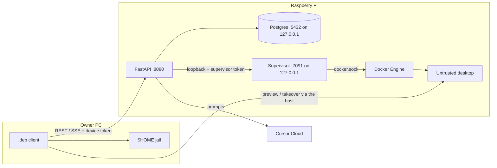

# Threat model

A reviewer should be able to answer **what is trusted, what is not, and what
remains open** from this page. Residual risk is named on purpose.

How to report a vuln: [SECURITY.md](SECURITY.md).

## What is trusted

- The Raspberry Pi: kernel, Docker Engine, host API container, worker,
  supervisor, Postgres, optional memory gateway.
- The owner’s paired Linux `.deb` (device token on that PC).
- Cursor Cloud as the live model runtime (prompts and relevant context leave
  the Pi).

The host API process is trusted-equivalent to the Pi. A Cursor agent inside
that container that can `printenv` is not a product bug ([SECURITY.md](SECURITY.md)).

## What is not trusted

- Bot desktop containers (Xvfb / Chromium / noVNC). They are the agent’s
  environment, not the owner PC.
- Model output and anything the model puts in a tool call.
- Recalled memory text used as *instructions* (the host marks it as data).
- Any client that can reach `:8080` without a valid bearer (LAN, Funnel, a
  leaked token).

Owner `$HOME` is reachable only through the paired `.deb` jail, not from the
desktop container.

## Diagram

`AGENT_HTTP_TOKEN` and `docker.sock` stay on the Pi. Pairing mints a **device
token** for the window. The supervisor bearer is derived from the host token
(or `SANDBOX_SUPERVISOR_TOKEN`) and is **not** interchangeable with
`AGENT_HTTP_TOKEN`.

## Bind story (`:8080`)

Today the API listens on **every interface the kernel has**:

| Knob | Value |
| --- | --- |
| Compose | `network_mode: host` |
| Settings | `HTTP_HOST` default `0.0.0.0` (`config.py`, compose `HTTP_HOST: 0.0.0.0`) |
| Supervisor | `SUPERVISOR_HOST=127.0.0.1`, port `7091` |
| Postgres | published `127.0.0.1:5432` |
| Memory gateway | `127.0.0.1:8420` |
| Desktop noVNC | host ports bound `127.0.0.1` (random high ports) |

Tailscale is **policy**, not a bind. MagicDNS / a tailnet IP is how the owner
PC is supposed to reach `:8080`. Nothing in the process restricts listen to
the Tailscale interface. A LAN neighbor, a leaked Funnel hostname, or
`0.0.0.0` plus a router forward all see the same FastAPI.

This issue does **not** change `HTTP_HOST`. Stronger options, if we take them
later: bind to the tailnet address, a host firewall that only allows the
tailnet, or Tailscale **Serve** instead of Funnel. Funnel still publishes the
**whole** host API (`README` step 6). `/novnc` HTTP and the screen WebSocket
need a Bearer or the host-page `artek_device` cookie; every other
route on that hostname does too, including pairing and tokens.

OpenAPI is off at runtime (`docs_url=None`, `openapi_url=None` in `main.py`).
CI dumps `app.openapi()` into `client/web/openapi.json` for TypeScript types;
that file is not served.

## Table

| Asset | Threat | Boundary | Mitigation | Residual |
| --- | --- | --- | --- | --- |
| `AGENT_HTTP_TOKEN` | Stolen or placeholder token drives bots, memory, routines, sandboxes | Host HTTP | Reject empty/placeholder at boot; `secrets.compare_digest`; pairing mint is host-only | Anyone who can call `:8080` with this token *is* the host. Funnel or LAN makes theft remote. |
| Device token (`dev_…`) | Stolen `~/.config/artek-buddy/token` or the host page cookie | Owner PC / phone browser + host HTTP | CSPRNG `token_urlsafe`; files mode `600`; cookie is `HttpOnly` + `SameSite=Lax` (Secure on HTTPS); missing bearer 401, bad token 403; host token in a cookie is ignored | A leaked device token is a full API credential. Funnel makes it a public credential. The phone cookie is that token. |
| Host-served window | Funnel visitor sees pairing + `/v1` | Host HTTP | Pairing code; cookie auth; `/local/owner-*` on the host is 403 | The page is the API origin. This-PC tools stay on the Linux `.deb`. iOS home-screen alerts only fire while that app is open unless we later add Web Push. |
| Pairing code | Online guess / replay | Host HTTP | 8 chars from a 32-symbol alphabet, 15‑minute TTL, hashed at rest, 8 failures / 5 min per client | Limiter is in-memory (resets on host restart). Host token still mints codes. |
| Supervisor token / `:7091` | Call create/exec/remove as the supervisor | Loopback HTTP | Listen `127.0.0.1`; separate derived bearer; host token must not work on `:7091` | Compare is string equality, not `compare_digest`. Process on the Pi that can hit loopback and the token owns Docker via the supervisor. |
| `docker.sock` on the supervisor | Container breakout = root on the Pi | Unix socket mount | Only the supervisor container gets the socket; desktops do not | The supervisor **is** root-equivalent. A bug in that process is a host compromise. |
| Untrusted desktop | Agent breakout, lateral movement, noisy neighbors | Container + `artek-computers` network | `CapDrop: ALL`; `no-new-privileges`; 1536 MiB / 1 CPU / 512 pids; tmpfs `/tmp` (`noexec`); `enable_icc=false`; noVNC on `127.0.0.1`; capability consent in the thread | **Still root in the box.** Live browse canary (`test_browse_allow_starts_chromium`) saw no `chromium` process after Allow as uid 1000. Chromium stderr is inside the box, not compose logs. Chromium uses `--no-sandbox --disable-setuid-sandbox`. Rootfs is writable. No gVisor. Fluxbox is started from `/usr`, not a script on `/tmp`. |
| Funnel / public HTTPS | Whole API on the internet | Tailscale Funnel | Documented as optional and dangerous; `/novnc` Bearer or device cookie | Funnel is not “safe HTTPS for the window”. It is a public bind of `:8080`. |
| Model prompt injection | Recalled notes or page text treated as orders | Host → Cursor Cloud | Owner book and work notes stay data (`<owner_book>`, `<work_notes>`). Bot book (`<bot_book>`) is standing instructions this host saved for that chat. Playbook names sit in `<skill_books>`; the steps enter only after `open_book`. A fetched skill is untrusted instructions (same class as page text); Allow/Deny on that origin is the brake. A reply from another inbox bot is that bot's last message only, not their thread. Browse/click/write wait on Allow/Deny | Owner book, an installed skill, and another bot's last message can still try to jailbreak. Consent is the brake. Charter is trusted because it was written on this host, not scraped from a page. The model is outside the Pi; injection can still request tools. |
| Bot-authored chat link | A deceptive or malformed URL replaces the `.deb` shell or launches an unsafe handler | Thread → owner browser | Links require an explicit owner click. The WebKit navigation policy keeps the loopback shell in place and launches only absolute external `http(s)` without URL credentials. Link context actions use the same validation; Copy URL has a local clipboard fallback. | A valid `http(s)` page can still be phishing or malicious. The system browser and its profile enforce the remaining boundary. |
| Host fetch of a skill URL | `install_book` aimed at loopback, RFC1918, link-local, or cloud metadata | Host HTTP client | Scheme http/https only; no userinfo; resolve every address and refuse loopback / private / link-local / CGNAT / metadata; do not follow redirects. Scripted tests may fetch one in-process fixture URL. | DNS can rebind between the check and the GET (TOCTOU). Residual: treat fetched markdown as untrusted, same as page text. |
| Desktop breakout | Escape to the Pi or another bot | Engine + network | Isolated compose network, ICC off, CapDrop ALL, host token never in the page | Root in the desktop, `--no-sandbox` Chromium, writable rootfs, Docker socket on the supervisor, shared Team home. |
| Owner `$HOME` | Read/write/exec outside the home | Paired `.deb` | `inspect_owner_path` jail under the owner home; write/exec consent per bot | Jail is the **logical** path then `resolve()`. Symlinks and bind mounts on the owner PC are a residual. Auto owner-read of files still happens without a card. |
| Owner job delivery | A stale id, reconnect, or two windows executes the wrong write/command twice or lets the losing window fail the winner's work | Host ↔ paired `.deb` | Request ids stay on the current call stack; a new client atomically ACK-claims queued work and must return its private claim nonce with the result; a losing client stands down; Postgres stores lifecycle but not command/file content; terminal jobs reject late results | An old client that does not ACK remains compatible and cannot prevent two old windows from performing the same side effect. The claim nonce is process-local; host restart loses the in-memory payload and the run fails instead of replaying it. |
| Owner question resume | Another client answers a blocked agent, answers twice, or injects a secret into the resumed model call | Host ↔ paired client ↔ Cursor | Pairing/device auth is required; the answer must match the pending bot, run, and message in the process-local waiter; the first answer closes the card and later answers return conflict; the lead is told not to request passwords | The answer is sent to Cursor as a tool result. Wait state is process-local: host restart fails the run instead of restoring the model stack. A paired client for this host can answer any visible pending question. |
| SSH ControlMaster socket | Another local process attaches to or stops a reused SSH connection | Owner PC | Explicit `~/.config/artek-buddy/ssh-mux` opt-in; dedicated `%C` path in a `0700` directory; bounded `ControlPersist`; wrapper affects only owner-exec and does not write keys or `~/.ssh/config` | A process running as the same owner can access the session. A killed client may leave a socket until OpenSSH expires it. Absolute `/usr/bin/ssh` bypasses the wrapper. |
| Fresh-session resume brief | Stale or injected remembered text becomes a command, or a secret is repeated to the model | Host → Cursor Cloud | Only bounded existing facts and visible bot text; env/bearer/home redaction; tagged as reference data; says tool history is unavailable and mutable state must be verified; sent once to a fresh lead session | The model still sees path/branch/constraint text and can follow a malicious remembered line. Redaction is pattern-based, not a complete data-loss-prevention system. |
| Loopback `/local/*` RPC | Another page on this PC calls owner-exec / pair / unpair | Paired `.deb` HTTP | Mutating calls: required Origin matching the window; Host; reject `Sec-Fetch-Site: cross-site`; JSON Content-Type; size cap; process nonce (`hmac.compare_digest`). `GET /local/status` may omit Origin; wrong Origin or `cross-site` is still 403. | A process on the owner PC that can hit loopback can read the nonce from status. `shell=True` owner-exec remains. The optional SSH wrapper inherits the owner environment and agent socket. |
| Postgres | Remote SQL, weak password | Host network | Port published `127.0.0.1:5432` only; password from `.env`. Host and worker migrate on boot under `pg_advisory_lock`; applied files store sha256 and a rewritten historical file fails the run. | `network_mode: host` on the API still talks to that port. Placeholder DB passwords are an operator miss. |
| GHCR / Release `.deb` | Supply-chain swap | GitHub + Actions | Release only after green `test` on that `main` SHA; host image Trivy HIGH/CRITICAL on the digest before tagging `latest`; no `--clobber`; Releases are not pruned by the default workflow; `SHA256SUMS`; CycloneDX SBOM of the packaged `.deb` and host image; GitHub Artifact Attestations; Actions pinned by commit SHA; CodeQL / pip-audit / Trivy | pytest-only pip-audit ignores (not in the host image) are listed in `.github/pip-audit-ignore.txt` with a reason and expiry. Computer image is **not** built in Actions. A digest that fails Trivy is still in GHCR until GC, untagged as `latest`. |
| `CURSOR_API_KEY` | Leak in Actions logs or the window | Actions secret + host env | `ui` job does not get the key; workflows must not `echo` env / `docker compose config` | Live canary needs the secret. A workflow edit that prints env is a leak. |
| Provider keys in Postgres | Stolen DB dump or a verbose log line | Host Postgres on loopback | Keys stay on the Pi; `GET /v1/models/credentials` returns last four only; connect body is not logged; `observe` redacts env `CURSOR_API_KEY` | A process that can read Postgres on the Pi owns every pasted key. Forget clears the row; an env seed recreates Cursor only when no Cursor row exists. |
| Connected-app key in Postgres | Stolen DB dump, a verbose error, or a tool result that repeats the key | Host Postgres on loopback | `GET /v1/connections/status` returns last four only; errors strip the key; logs redact a broker key if it is also in the process env; `observe` redacts env `COMPOSIO_API_KEY` | A process that can read Postgres on the Pi owns the pasted key. An env seed writes the key only when no key exists yet. Catalog names and tool text from a connected app are untrusted, same class as owner-book injection. `connect_app` can put a third-party login URL on a thread card; the owner opens it. The host uses a fixed https callback, not the window origin. |
| Host logs | Token, pairing code, or home path in a log line | Host / worker / supervisor | JSON in Docker; `request_id` on HTTP, `threads.send`, and tool lines; redact bearer, env secrets, pairing, `/novnc`, `/home/<user>` | Do not log bodies or screenshots. Funnel still means a stolen token is remote. |

## Open by design

1. `:8080` on `0.0.0.0` + `network_mode: host`. Tailscale is how you *should* reach it, not how the socket is bound.
2. Funnel = public API. Do not treat it as a pairing-only portal.
3. Desktop boxes drop all capabilities and have Pi 5-sized memory/CPU/pids limits. They stay **root**: uid 1000 did not start Chromium in the live canary. They are not a kernel jail: Chromium is `--no-sandbox`, the rootfs is writable, and there is no gVisor.
4. `docker.sock` on the supervisor is required for this product shape; the threat is “supervisor bug = Pi root”, not “we forgot the socket”.
5. The paired `.deb` can run a shell on the owner PC (`/local/owner-exec`, loopback + this-window Origin + process nonce, `$HOME` jail). That is the owner, not the sandbox. CodeQL `py/command-line-injection` on that line is accepted residual risk, not a forgotten `shell=True`.
