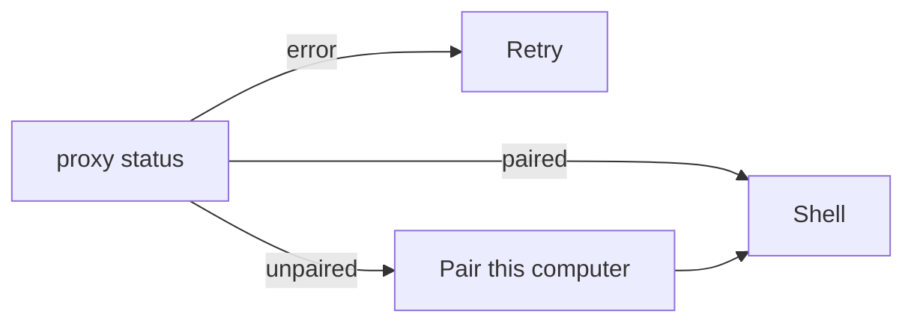

# Client window map

This is the product window: `artek_buddy.py` (GTK/WebKit + loopback proxy) plus `web/`.
The page never sees `~/.config/artek-buddy/token`. Update this file in the same change as the UI.



```
┌──────── sidebar 316px ────────┬────────────── thread ──────────────┬── computer pane ──┐
│ chrome  +                                                     │ header: bot name → Settings │ gear  ✕           │
│ Search                                                        │ thread / empty / create     │ state badge       │
│ bot rows  (unread · pin · preview)                            │ composer  +  textarea  ⏹ ➤  │ preview iframe    │
│ Archived (n)                                                  │                             │ Open / Take / Rel │
│ Plugins  (toast: later)                                       │ overlays: create / settings │ Memory            │
│ You                                                           │ attention (top, Dismiss)    │ Routines          │
└───────────────────────────────────────────────────────────────┴─────────────────────────────┴───────────────────┘
```

The computer pane and Settings overlay sit on the right of the same shell. Gear on the pane opens Settings; closing Settings returns to the pane. Create opened while the pane is up returns to the pane after Create or Cancel. Release does not close the pane. Fullscreen screen is a separate overlay. Gear in the thread header opens Settings and does **not** boot. Offline • Click to start boots and takes control.

## Screens

| Screen | When | Controls |
| --- | --- | --- |
| Proxy error | loopback `status` failed | Retry (reload) |
| Pairing | not paired | Mascot mark, Host URL (last host from boot status, not refetched), code `XXXX-XXXX`, device name, Pair. Fail text under the form. |
| Shell | paired | sidebar + thread; optional Settings / Create / computer pane / fullscreen. Pairing does not open the pane. Create focuses the new chat. Gear opens the pane without booting. Offline boots. |

Auth error in the thread: **Pair this computer again** → `unpair` → pairing.

## Sidebar

- `+` opens Create.
- Search filters inbox and archived by name / preview.
- Bot row: name, pin mark, unread dot, status, preview. Accessible name is `Open chat {name}`. Click opens the chat. Right-click: Pin / Unpin, Mark read / unread, Edit Profile, Duplicate, Archive, Delete. Inbox order is pinned first, then created; a later message does not jump a row under the pointer.
- The selected row, thread header, composer, and computer pane always name the same bot. The thread never blanks to an empty column on a switch.
- Empty inbox (all archived): Restore one from Archived, or create a new bot.
- No bots: Create your first bot.
- Archived list: Back to Inbox, Restore on each row.
- Plugins: toast only (`Plugins ship with a later stage.`).
- You: label, not a settings screen.

## Thread

SSE. Blocks in a message:

| Block | What you see |
| --- | --- |
| user / bot text | markdown bubbles; user is right-aligned |
| hidden live draft | not shown |
| progress | streaming bot bubble |
| meta | centered clock line |
| card | check rows (`k → v`) |
| ask | question + options or free text |
| consent | Allow once / Always / Deny (browse, page, owner_*) |
| file | name, media preview, Download |
| computer | reason + **Open computer** while `waiting_takeover`; after Release the same run resumes |
| subagent | `#n name`, status, Stop while running, Restart after |
| child_bot | click opens that chat (disabled if deleted/archived) |

Also: Reply on right-click (`reply-bar`, quote in the next user bubble), Load earlier (`load-earlier`), typing indicator, `run-error` for failed / cancelled, Stop (lead + workers, `thread-stop`). Composer: Enter send, Shift+Enter newline, undo/redo, Plus / drop / Ctrl+V (file, screenshot, file-manager path). Attachment chips with preview. Attention banner sits under the thread header (`attention-alert`): replied / ask / takeover / failed. It is in the layout, so it does not cover Send or Load earlier. Opening that chat or Dismiss (`attention-dismiss`) is sticky for that ask or takeover: switching chats does not resurrect a dismissed or already-answered pill. It is not shown for the chat already on screen, or for events from before this window opened. A chat you already read that then finishes in the background still raises replied / failed. Finishing a turn does not switch the open chat. A newer banner replaces an older one of the same urgency; an older leftover cannot keep the pill. Title opens that chat; Dismiss (`attention-dismiss`) does not. `notifyOnFinish` mutes only replied / failed. Thread header is `thread-header`. Send stays enabled while a bot is selected so Enter can post the live textarea; an empty click is a no-op.

The open chat uses `/v1/threads/{id}/events` for the thread. Inbox banners use one `/v1/events` stream for every bot, including the open chat, so a switch cannot drop `run.completed`. Duplicate event ids are ignored. Chrome HTTP/1.1 allows six connections per host; one SSE per leftover chat would starve Create and pair.

Block test ids: `meta-block`, `progress-block`, `check-card`, `computer-card`, `open-computer`, `subagent-card`, `child-bot-card`, plus the existing `file-card` / `ask-card` / `consent-card`.

Errors: host Retry, auth re-pair, action Dismiss.

If the user is pinned to the bottom, new cards keep the latest in view. Switching chats lands on the latest messages. Stop cancels the lead and workers; a later completed token must not append. The host prompt includes a compact summary of this chat (byte-capped) plus owner lines that never reached the model (inbox kept across Stop). `waiting_takeover` is a pause: no typing dots and no Stop. A new send starts a turn. **Release** resumes the same parked run.

Not in this window: `threads.followUp` (the host queues on send while a lead is running; a parked takeover starts work), `subagents.steer`, `me`, `deployment`. `notify-send` exists on the proxy and is unused by React.

## Create / Settings

Create: name, title, description, Team | Private (`computer-mode-team` / `computer-mode-private`).

Settings: the same fields plus instructions, mode change (rebinds the desktop; home is not copied), Restart / Stop / Reset (Reset wipes that home; Team reset wipes the shared desktop), busy-bot name, notifyOnFinish, Delete with optional purge memories.

## Computer pane

States: Offline, Booting, Running, Sleeping, Error (`computer-state` / `data-state`). Click Offline to boot and take control. Click Sleeping to wake. Gear does not auto-boot. Stop in Settings is Sleeping (`suspended`), not Offline. Preview click / Open screen opens the screen view (`computer-overlay`) and does **not** grant control. Take control is the only control grant (`computer-overlay-holder` while held). Caps Lock is forwarded during Take control. View-only preview iframe when the screen URL is `/novnc/…`. Fake sandbox has no noVNC URL, so the pane shows `computer-running` instead of spinning Connecting. Open screen / fullscreen overlay. Take control / Release. Heartbeat 60s. Retry. Team busy shows `{name} is using the computer` on the start tile (one line; the bot that booted or holds the shared desktop, not only a bot with an active run) and disables Take / Restart / Stop / Reset. The pane keeps the start tile in that case instead of the running preview. Dedicated vs Team is `computer-label` `data-mode`.

Memory (same pane): owner / work / charter list, New (this bot \| shared, `memory-save`), Edit, Outdated = delete, Export `.md`.

Routines (same pane): New (name, cron, prompt; invalid cron disables Save), on/off, Run (`POST .../test`), Delete.

## Consent and this PC

Allow once / Always / Deny for browse, page, and owner_*. A read-only owner job marked `auto` runs without a card (`/local/owner-*`). After Allow the client reads, writes, lists, or execs under `$HOME` and posts the result. Paths outside `$HOME` are 403 and stay on the consent card. Composer Stop is `thread-stop` (`aria-label="Stop"`); the thread title is `Open settings for {name}`.

## Loopback proxy (`/local/*`)

`status`, `pair`, `unpair`, `owner-read` / `owner-write` / `owner-list` / `owner-exec` (HOME only; XDG aliases such as Downloads / Загрузки), `attach-files` (25 MiB / 50 MiB / 10 files), `save-artifact` / `save-home-file`, `notify`. Also proxies `/v1/*`, `/health`, `/novnc/*` (HTTP and WebSocket).
