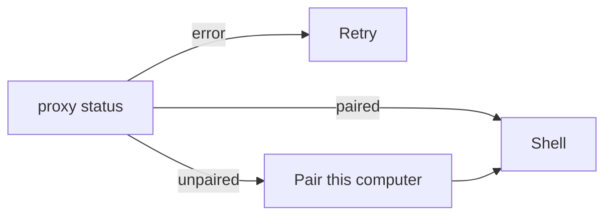

# Client window map

This is the product window: `artek_buddy.py` (GTK/WebKit + loopback proxy) plus `web/`.
The page never sees `~/.config/artek-buddy/token`. Update this file in the same change as the UI.



```
┌──────── sidebar 316px ────────┬────────────── thread ──────────────┬── computer pane ──┐
│ chrome  +                                                     │ header: bot name → Settings │ gear  ✕           │
│ Search                                                        │ thread / empty / create     │ state badge       │
│ bot rows  (unread · pin · preview)                            │ composer  +  textarea  ⏹ ➤  │ preview iframe    │
│ Archived (n)                                                  │                             │ Open / Take / Rel │
│ Plugins  (toast: later)                                       │ overlays: create / settings │ Memory            │
│ You                                                           │                             │ Routines          │
└───────────────────────────────────────────────────────────────┴─────────────────────────────┴───────────────────┘
```

The computer pane and Settings overlay sit on the right of the same shell. Fullscreen screen is a separate overlay.

## Screens

| Screen | When | Controls |
| --- | --- | --- |
| Proxy error | loopback `status` failed | Retry (reload) |
| Pairing | not paired | Mascot mark, Host URL, code `XXXX-XXXX`, device name, Pair. Fail text under the form. |
| Shell | paired | sidebar + thread; optional Settings / Create / computer pane / fullscreen |

Auth error in the thread: **Pair this computer again** → `unpair` → pairing.

## Sidebar

- `+` opens Create.
- Search filters inbox and archived by name / preview.
- Bot row: name, pin mark, unread dot, status, preview. Click opens the chat. Right-click: Pin / Unpin, Mark read / unread, Edit Profile, Duplicate, Archive, Delete.
- Empty inbox (all archived): Restore one from Archived, or create a new bot.
- No bots: Create your first bot.
- Archived list: Back to Inbox, Restore on each row.
- Plugins: toast only (`Plugins ship with a later stage.`).
- You: label, not a settings screen.

## Thread

SSE. Blocks in a message:

| Block | What you see |
| --- | --- |
| user / bot text | markdown bubbles; user is right-aligned |
| hidden live draft | not shown |
| progress | streaming bot bubble |
| meta | centered clock line |
| card | check rows (`k → v`) |
| ask | question + options or free text |
| consent | Allow once / Always / Deny (browse, page, owner_*) |
| file | name, media preview, Download |
| computer | tool card (state + text) |
| subagent | `#n name`, status, Stop while running, Restart after |
| child_bot | click opens that chat (disabled if deleted/archived) |

Also: Reply on right-click (quote in the next user bubble), Load earlier, typing indicator, `run-error` for failed / cancelled, Stop (lead + workers). Composer: Enter send, Shift+Enter newline, undo/redo, Plus / drop / Ctrl+V (file, screenshot, file-manager path). Attachment chips with preview. Attention banner: replied / ask / takeover / failed. `notifyOnFinish` mutes only replied / failed.

Errors: host Retry, auth re-pair, action Dismiss.

Not in this window: `threads.followUp` (the host queues on send), `subagents.steer`, `me`, `deployment`. `notify-send` exists on the proxy and is unused by React.

## Create / Settings

Create: name, title, description, Team | Private.

Settings: the same fields plus instructions, mode change (rebinds the desktop; home is not copied), Restart / Stop / Reset (Reset wipes that home; Team reset wipes the shared desktop), busy-bot name, notifyOnFinish, Delete with optional purge memories.

## Computer pane

States: Offline, Booting, Running, Sleeping, Error. Click Offline to boot and take control. View-only preview iframe. Open screen / fullscreen overlay. Take control / Release. Heartbeat 60s. Retry. Team busy shows the other bot’s name.

Memory (same pane): owner / work / charter list, New (this bot \| shared), Edit, Outdated = delete, Export `.md`.

Routines (same pane): New (name, cron, prompt; invalid cron disables Save), on/off, Run (`POST .../test`), Delete.

## Consent and this PC

Allow once / Always / Deny for browse, page, and owner_*. A read-only owner job marked `auto` runs without a card (`/local/owner-*`). After Allow the client reads, writes, lists, or execs under `$HOME` and posts the result. Paths outside `$HOME` are 403.

## Loopback proxy (`/local/*`)

`status`, `pair`, `unpair`, `owner-read` / `owner-write` / `owner-list` / `owner-exec` (HOME only; XDG aliases such as Downloads / Загрузки), `attach-files` (25 MiB / 50 MiB / 10 files), `save-artifact` / `save-home-file`, `notify`. Also proxies `/v1/*`, `/health`, `/novnc/*` (HTTP and WebSocket).
