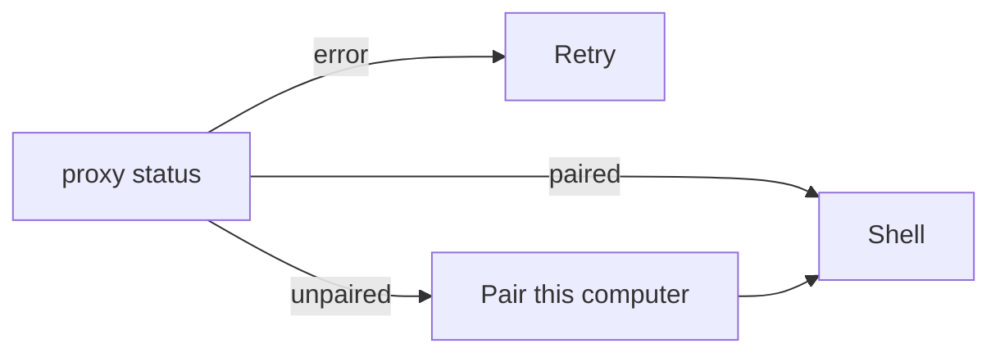

# Client window map

This is the product window: `artek_buddy.py` (GTK/WebKit + loopback proxy) plus `web/`.
The same page is also served from the host on `:8080` for a phone browser / home-screen app.
The page never sees `~/.config/artek-buddy/token` or `AGENT_HTTP_TOKEN`. Update this file in the same change as the UI.



```
┌── rack 252px ──┬──────── bench / thread ────────┬── hatch 360px ──┐
│ chrome         │ header: name (identity)        │ state badge     │
│ Search inbox   │ Computer · Settings            │ Settings Close  │
│ New bot        │ attention plate + Dismiss      │ Preview · view  │
│ bot rows       │ thread / empty / create        │ Open / Take /   │
│ Archived       │ composer strip  chips Attach   │ Rel             │
│ Plugins        │ Send · Stop while a run is live│ Memory Routines │
│ You → Models   │                                │                 │
└────────────────┴────────────────────────────────┴─────────────────┘
```

The computer pane, Models, and Settings overlay sit on the right of the same shell. Settings on the pane opens Settings; closing Settings returns to the pane. Create opened while the pane is up returns to the pane after Create or Cancel. Models opened while the computer pane is up returns to the pane on Close. Release does not close the pane. Fullscreen screen is a separate overlay. Settings does **not** boot. Offline • Click to start boots to a view-only Running preview. Take control is a separate grant. A bot that opens a path updates the tile without a click. Pairing does not open Models.

## Screens

| Screen | When | Controls |
| --- | --- | --- |
| Proxy error | loopback `status` failed | Retry (reload) |
| Pairing | not paired | Lying-pose mark, Host URL (last host from boot status, not refetched; **hidden on the host page**), code `XXXX-XXXX`, device name (`Phone` on the host page), Pair (disabled until the code is non-empty). Fail text under the form. Visible tan `:focus-visible`. Host page title is Pair this phone. |
| Shell | paired | rack + thread; optional Settings / Create / computer pane / Models / Plugins / fullscreen. Pairing does not open the pane or Models. Create focuses the new chat. Settings opens the pane without booting. Offline boots view-only. A bot that opens a path updates the tile. You opens Models. Plugins opens the apps pane (works with an empty inbox). |
| Phone (width ≤720, or a short landscape phone such as 812×375) | host page or a narrow window | One column. A wide window (1280×720 and up) stays the three-column `.deb` shell. Bottom `phone-nav`: Chats / Chat / Desktop (`phone-tab-*`). Tap targets 44px. `safe-area-inset-top` clears the notch; the nav and the shell share one bottom inset (no second empty strip). Inbox list fills the space between Search and Plugins / Models so bot rows stay on screen. Create / Models / Plugins open Desktop. Close on Computer / Models / Plugins, the Desktop pane, or the fullscreen ✕ returns to Chat (not a blank Desktop tab). Pad / Keyboard exist only on the fullscreen desktop (`computer-overlay` `data-phone-desk`): the finger is a pad — drag moves the pointer, tap is left click at that pointer, two fingers is right click or scroll. The tan cursor sits on the letterboxed 1280×800 guest. Keyboard extras (Esc / Tab / Enter / Bksp / Del / arrows) sit in one row under a tappable **Type on the desktop** field. The overlay chrome does not select as host text. A pad drag or tap keeps Take control until **Release**. The overlay stays in the visible viewport so the guest does not scroll away under the keys. Typing uses the phone keyboard, including Cyrillic. The phone’s Done checkmark dismisses that keyboard; tapping the pad does not. Chats and Chat stay the ordinary list and thread. `.deb` wide overlay stays the mouse iframe. iPhone Share → Add to Home Screen (`home-screen-hint`) sits at the top of the shell (`phone-host-banners`), not over Models / composer / the nav; Got it dismisses it. `turn-on-alerts` asks for web notifications after a tap; iOS only exposes that from the home-screen icon. No This-PC Allow on the phone filesystem. |

Auth error in the thread: **Pair this computer again** → `unpair` → pairing.

## Sidebar (rack)

- **New bot** opens Create. Accessible name is the visible label.
- Search filters inbox and archived by name / preview. Accessible name is `Search inbox`.
- Bot row: Fraunces name, pin mark, tan square unread pin (`unread-dot`), status, preview. Selected row has a tan 3px left rail. Accessible name is `Open chat {name}`. Click opens the chat. Right-click: Pin / Unpin, Mark as read / unread, Edit profile, Duplicate, Archive, Delete. Inbox order is pinned first, then created; a later message does not jump a row under the pointer.
- The selected row, thread header, composer, and computer pane always name the same bot. The thread never blanks to an empty column on a switch.
- Empty inbox (all archived): Restore one from Archived, or create a new bot.
- No bots: Create your first bot.
- Archived list: Back to Inbox, Restore on each row.
- **Plugins** (`open-plugins`) opens the apps pane (`plugins-pane`). Works with an empty inbox. Not a toast.
- You: door to **Models** (host keys). The visible word on the control is Models. Not a tooltip. Per-bot Settings stay name / mode / Reset / Delete.

## Thread

SSE. Blocks in a message:

| Block | What you see |
| --- | --- |
| user / bot text | markdown bubbles; user is paper on the right, bot is plate on the left |
| hidden live draft | not shown |
| progress | streaming bot bubble |
| meta | centered clock line |
| card | check rows (`k → v`) |
| ask | question + options or free text |
| consent | Allow once / Always / Deny (browse, page, owner_*) |
| file | name, media preview, Download |
| computer | reason + **Open computer** while `waiting_takeover`; after Release the same run resumes |
| plugin | connected app name + result (`plugin-card`). A login URL on that card is **Open to connect** (`plugin-connect-open`), owner browser, not the bot desktop |
| book | playbook name + Saved / opened steps / Forgotten (`book-card`) |
| subagent | not shown; the lead writes a one-line Started / Finished / Stopped `{name}` |
| child_bot | click opens that chat (disabled if deleted/archived). After `message_bot`, one card is the other inbox bot plus the question |

Also: Reply on right-click (`reply-bar`, quote in the next user bubble), Load earlier (`load-earlier`), typing indicator (`ab-pulse`, honors `prefers-reduced-motion`), `run-error` for failed / cancelled, Stop (lead + workers, `thread-stop`, hidden while `waiting_takeover`). Composer is a full-width strip: Enter send, Shift+Enter newline, undo/redo, Attach / drop / Ctrl+V (file, screenshot, file-manager path). Ctrl+V of an image attaches even when the clip has no `files` list yet; ordinary text is not stolen. Attachment chips with preview. **Send** is disabled when there is no text and no files. Attention sits under the thread header (`attention-alert`) as a plate with a tan left rail: replied / ask / takeover / failed. It is in the layout, so it does not cover Send or Load earlier. Opening that chat or Dismiss (`attention-dismiss`) is sticky for that ask or takeover: switching chats does not resurrect a dismissed or already-answered pill. It is not shown for the chat already on screen, or for events from before this window opened. A bot that is already `waiting_takeover` still raises «needs you» after you open another chat, even if the takeover event arrived while that chat was open or the list first saw that bot already parked. A leftover park from before this window opened does not. A chat created in this window is not treated as leftover even if the host stamp is behind the window clock. Opening the parked chat sticks Dismiss only when you switch onto it, not when the takeover arrived while it was already open. A background running turn is refreshed so a later park still raises the pill. A background parked chat stays watched the same way, so a missed first raise still appears. A chat you already read that then finishes in the background still raises replied / failed. Finishing a turn does not switch the open chat. A newer banner replaces an older one of the same urgency; an older leftover cannot keep the pill. Title opens that chat; Dismiss does not. `notifyOnFinish` mutes only replied / failed. Thread header (`thread-header`) is the bot name, not a Settings control. **Computer** and **Settings** are separate labeled buttons.

Ask another inbox bot (`message_bot` / `POST /v1/bots/{id}/asks`): this chat shows «Asked {name}: {question}» and a `child_bot` card. Their chat shows who asked and the question, then they work there. When they finish, this chat gets a short «{name} is ready» card and a new turn that answers you from **their last message only** — not their tools, progress, or computer cards. Stop still cancels either chat.

The open chat uses `/v1/threads/{id}/events` for the thread. Inbox banners use one `/v1/events` stream for every bot, including the open chat, so a switch cannot drop `run.completed`. Duplicate event ids are ignored. Chrome HTTP/1.1 allows six connections per host; one SSE per leftover chat would starve Create and pair.

Block test ids: `meta-block`, `progress-block`, `check-card`, `computer-card`, `open-computer`, `plugin-card`, `book-card`, `child-bot-card`, plus the existing `file-card` / `ask-card` / `consent-card`. Worker cards (`subagent-card`) are not shown. After an app is connected, a chip (`plugin-ask-{slug}`) sits above Message. Click fills `please use {name}` and does not send. No key or no connected apps: no chip row. The lead can search with `list_apps` and attach with `connect_app` (same Connect as the pane). A playbook kept for this chat (installed from a public page, not taught in the thread) puts a chip (`book-ask-{slug}`) that fills `please run {name}`. That is not a Settings form and not a memory card.

Errors: host down shows a reconnect banner (`reconnect-banner`, Retry connection) under the thread header, not only a red card. Send while the host is unreachable parks the user bubble and an outbound queue for that chat (survives switch, Stop, and reload; no token in storage). Auth errors still re-pair and do not queue. After health is back the queue flushes in order; that bubble keeps `offline-sent-caption` («Sent while offline ·» local time). A later online send has no caption. Action Dismiss.

If the user is pinned to the bottom, new cards keep the latest in view. Switching chats lands on the latest messages. Stop cancels the lead and workers; a later completed token must not append. The host prompt includes a compact summary of this chat (byte-capped) plus owner lines that never reached the model (inbox kept across Stop). `waiting_takeover` is a pause: no typing dots and no Stop. A new send starts a turn. **Release** resumes the same parked run.

Not in this window: `threads.followUp` (the host queues on send while a lead is running; a parked takeover starts work), `subagents.steer`, `me`, `deployment`. `notify-send` exists on the proxy and is unused by React.

## Models (host)

Host-wide. Open from **You** (`open-models`). Close returns to the thread, and to the computer pane if that was open.

```
┌── Models ──┐
│ Cursor     │  API key · Save · Forget · model chips · Use this model
│            │  Reasoning · Fast · Save
│ OpenRouter │  same key + chips
│ OpenAI     │
│ Anthropic  │
│ xAI (Grok) │
│ Using {id} · effort · Fast │
└────────────┘
```

Fresh host: five empty rows, thread plate `needs-model` (`open-models-thread`) with the next step. There is no second Default model list. Save on a row fetches that catalog and uses the preferred id (`grok-4.6` when present, else the first). Cursor also sets extra-high reasoning and Fast. Save always reports success or an error under that row — a failed host call is never silent. Model chips are ink on paper so names stay readable. Empty list: `No models yet`. After Save the field is gone: `••••` + last four + Connected. Forget empties that row. Cursor model names come from the running host after that key is connected. Send with no chosen model does not start a turn; the thread repeats the next step. The page never receives a previously saved full key.

Reasoning and Fast persist for the next send without picking a different chip. Save next to Reasoning is enabled while Cursor already has a Using model. Use this model is enabled when a chip is already in use. The open chat gets a `meta-block`: `Using {id} · {effort} · Fast.` A live turn is not cancelled; that line ends with `This turn keeps going.` The next send starts a new model session.

Copy: Save, Forget, Retry, Models, API key, Model, Use this model, Reasoning, Fast, Extra high. Do not say credential, runtime, or env.

## Plugins (host)

Host-wide connected apps. Open from **Plugins** (`open-plugins`). Works with an empty inbox. Close returns to the thread.

```
┌── Plugins ──┐
│ Key         │  password field · Save · after save: Key saved · Replace / Remove
│ Search apps │
│ Catalog     │  Connect / Disconnect · Connected mark
└─────────────┘
```

Without a key the pane says to paste one. Save stays clickable on an empty field and says Paste a key first. A failed host call shows the error (`plugins-error`) — never silent. After a good Save the field is gone: Key saved + last four + Replace / Remove. GET never returns the full key. Search filters the catalog. Connect on a no-auth app marks it connected. Connect on an app that needs a browser opens that tab; Finish marks it connected. The lead can also `list_apps` / `connect_app` from chat (card, then the same Finish if login is pending). Disconnect removes its tools on the next turn. A connected app also puts a chip above Message; click fills `please use {name}` (owner reviews, then Send). That turn shows a `plugin-card` with the app name and the result. Disconnect or Remove hides the chip. The page never receives a previously saved full key.

Copy: Plugins, Plugins key, Save, Replace, Remove, Search apps, Connect, Disconnect, Finish, Connected, Key saved, Paste a key to connect apps.

## Create / Settings

Create: name, title, description, Team | Private (`computer-mode-team` / `computer-mode-private`).

Settings: the same fields plus instructions, mode change (rebinds the desktop; home is not copied), Restart / Stop / Reset (Reset wipes that home; Team reset wipes the shared desktop), busy-bot name, notifyOnFinish, Delete with optional purge memories. **Edit profile** opens the fields.

## Computer pane (hatch)

States: Offline, Booting, Running, Sleeping, Error (`computer-state` / `data-state`). Sleeping uses sage; Offline uses mute. Click Offline to boot view-only. Click Sleeping to wake view-only. Take control is a separate grant. Settings does not auto-boot. When the bot opens a path or uses the desktop, the tile goes Running without a click. Stop in Settings is Sleeping (`suspended`), not Offline. Preview click / Open screen opens the screen view (`computer-overlay`) and does **not** grant control. The preview bezel caption is **Preview · view only**. Take control is the only control grant (`computer-overlay-holder` while held). Caps Lock is forwarded during Take control. View-only preview iframe when the screen URL is `/novnc/…`. Opening the pane or overlay on a Booting or Running box fetches `GET /v1/computer/{id}/screen`; a bot-started desktop does not stay on the text-only **Desktop is running** fallback when that URL exists. Fake sandbox has no noVNC URL, so the pane shows `computer-running` instead of spinning Connecting. Open screen / fullscreen overlay. Take control / Release. Release remints a view-only `/novnc/…/view/` URL so the overlay keeps the last guest frame instead of a black control socket, and the pane matches (Take control, not You have control). After about two minutes with no overlay input the host Releases (holder is `bot` again). The 15-minute lease is a hard cap. The pane polls status (15s while Take control is held, otherwise 60s), including while a turn is live and the tile is still Offline. That poll is not use and does not refresh `sleep_at`. Overlay pointer, key, and scroll (including inside the noVNC frame) reset the idle timer; they do not go to the supervisor as a second input stream. Unused box sleeps after 15 minutes (`suspended`). Retry. Team busy shows `{name} is using the computer` on the start tile (one line; the bot that booted or holds the shared desktop, not only a bot with an active run) and disables Take / Restart / Stop / Reset. The pane keeps the start tile in that case instead of the running preview. Dedicated vs Team is `computer-label` `data-mode`.

Memory (same pane): owner / work / charter list, New (this bot \| shared, `memory-save`), Edit, Outdated = delete, Export `.md`.

Routines (same pane): New (name, cron, prompt; invalid cron disables Save), on/off, Run (`POST .../test`), Delete.

## Consent and this PC

Allow once / Always / Deny for browse, page, and owner_*. A read-only owner job marked `auto` runs without a card (`/local/owner-*`) on the Linux `.deb`. After Allow the desktop client reads, writes, lists, or execs under `$HOME` and posts the result. Paths outside `$HOME` are 403 and stay on the consent card. The host phone page never runs owner tools (`/local/owner-*` is 403; auto jobs fail closed). Composer Stop is `thread-stop` (`aria-label="Stop"`). Settings is the Settings button, not the thread title.

## Host page / phone

`GET /` and `/app` on `:8080` serve the same `web/` tree. `GET /local/status` returns `surface: host`. Pair sets `artek_device` (httpOnly). `--serve` stays the `.deb` / CI proxy. Manifest + apple-touch-icon for Add to Home Screen. Pair from that icon (Safari and the icon do not share the login). No background sync and no Web Push: alerts fire only while the home-screen app is open or still in memory. iPhone will not wake a killed app.

## Loopback proxy (`/local/*`)

`status`, `pair`, `unpair`, `owner-read` / `owner-write` / `owner-list` / `owner-exec` (HOME only; XDG aliases such as Downloads / Загрузки), `attach-files` (25 MiB / 50 MiB / 10 files), `save-artifact` / `save-home-file`, `notify`. Mutating `/local/*` requires loopback, `Host` matching this proxy, `Origin` matching the window (a missing Origin is denied), no `Sec-Fetch-Site: cross-site`, JSON `Content-Type`, a size cap, and `X-Artek-Local-Nonce` from `GET /local/status`. `GET /local/status` allows a missing Origin when `Host` matches and `Sec-Fetch-Site` is not `cross-site` (the window GET often omits Origin). Fail closed 403 (413 if the body is too large). No `Access-Control-Allow-Origin: *`. Also proxies `/v1/*`, `/health`, `/novnc/*` (HTTP and WebSocket).
