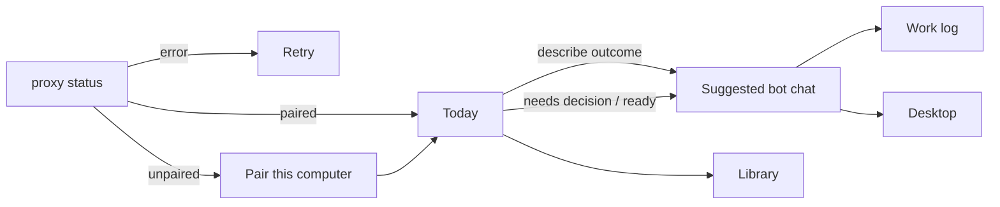

# Client window map

This is the product window: `artek_buddy.py` (GTK/WebKit + loopback proxy) plus `web/`.
The same page is also served from the host on `:8080` for a phone or a desktop browser. Take control follows the pointer in use (mouse = `.deb` iframe; coarse/phone = pad), not only the window width.
The page never sees `~/.config/artek-buddy/token` or `AGENT_HTTP_TOKEN`. Update this file in the same change as the UI.



```
┌ rail 88 ┬── Chats 220–420 ──┬──────── conversation / Today ────────┬ context 300–720 ┐
│ Today   │ Search            │ bot identity · status                │ Work log         │
│ Chats   │ New bot           │ decision / progress / result         │ Desktop          │
│ Routines│ bot rows          │ transcript                           │ Library          │
│ Library │ Archived          │ Message · Attach · Send / Stop       │ Models           │
│         │                   │                                       │ Connections      │
└─────────┴────── drag ───────┴────────────────────── drag ──────────┴──────────────────┘
```

The default post-pair destination is **Today**, not an arbitrary chat. Today begins with an outcome, suggests the most relevant existing bot, and places **Needs your decision** before **In progress** and **Ready for you**. Selecting an item enters the existing durable chat. The transcript keeps decisions and results; worker/tool detail is behind **Work log**.

The rail is the stable workspace map. **Chats** adds the inbox rack. **Library** is the single desktop door for Connections, Models, selected-bot Memory, and profile/access; the phone also exposes Routines there because its rail is hidden. **Desktop** contains only the desktop controls. The inbox and right context widths persist after dragging either divider; keyboard focus on a divider uses Left / Right, and double-click restores its default.

Context panels sit on the right of the same shell. A child panel closes to the context that opened it: Models, Connections, Memory, or Bot profile & access opened from Library return to Library. Release does not close Desktop. Fullscreen is a separate overlay. Bot profile & access does **not** boot. Offline • Click to start boots a view-only Running preview. Take control is a separate grant. Pairing opens neither Desktop nor Models.

Chrome colors come from `@theme`: navy navigation, ink canvas, plates, soft-blue selection, copper emphasis, sage success, and restrained danger. **Library → Appearance** offers System / Light / Dark. System follows Ubuntu/WebKit `prefers-color-scheme` live; a manual Light or Dark choice is saved on this device and overrides the OS. Native inputs and the Reasoning select use the same `color-scheme`, foreground, and surface tokens instead of a browser-white control with unreadable text. Settings, Memory, Routines, ask/file cards, and the Desktop overlay use the same semantic tokens. Traffic lights stay `close` / `min` / `full`. Guest noVNC pixels are not restyled.

The installed GTK3 client publishes an **Artek Buddy** tray indicator. Its menu has **Open Artek Buddy** and **Quit**. Closing the window hides it to the tray while the indicator is available, so background replies can still alert; **Open Artek Buddy** presents the same window and **Quit** stops the client. If the desktop has no StatusNotifier/AppIndicator support, close keeps the normal quit behavior.

The packaged launcher is **Artek Buddy** (`artek-buddy.desktop`, icon `artek-buddy`). Every hicolor size is generated from the same sky-blue Cavalier source, so the launcher, dock, window, tray, and notifications cannot select a stale black variant. The GTK process names itself `artek-buddy` / `Artek Buddy` before the window exists, so the dock and app menu keep that mark instead of a generic `artek_buddy.py` gear. The tray looks up the same PNG from the packaged icon directory.

## Screens

| Screen | When | Controls |
| --- | --- | --- |
| Proxy error | loopback `status` failed | Retry (reload) |
| Pairing | not paired | New navy / sky / cream Cavalier hero, code `XXXX-XXXX`, and one primary **Pair** action. Host URL and device name are under **Pairing options**; Host URL is absent on the host page. Pair stays disabled until the code is non-empty. Copy says to create a one-use code on the Pi, with no token or module jargon. `.deb` keeps the Compose command; the phone does not. |
| Today | paired, no selected chat required | Outcome field, suggested bot, Needs your decision, In progress, Ready for you, and a route to recurring work. |
| Chats | paired | Rail + resizable inbox + thread; optional Work log / Desktop / Library / Create. New bot focuses the created chat. |
| Library | paired | Appearance, Connections, and Models at workspace scope; Memory and profile/access for the selected bot. Phone More also lists Routines. |
| Phone (width ≤720, or a short landscape phone such as 812×375) | host page or a narrow window | One column. Bottom `phone-nav`: **Today / Chats / Desktop / More**. Today is the default. Chats first shows the inbox; choosing a bot shows its thread while Chats stays selected. More opens Library. Models and Connections close back to More; Desktop closes back to the selected chat. Tap targets are at least 44px. `safe-area-inset-top` clears the notch and there is one bottom inset. The coarse-pointer Desktop overlay keeps Pad / Keyboard, drag/tap/two-finger behavior, Cyrillic input, live frame refresh, and explicit Release. A mouse browser uses direct iframe pointer input. The Home Screen hint stays above content, never over the composer or nav. |

Auth error (`auth-error`), including a 401/403 on workspace `/v1/events` while thread REST still works: **Pair this computer again** (`.deb`) or **Pair this phone again** (host page) → `unpair` → pairing. The card sits above the scrolling thread so inbox load cannot hide it. Public `/health` 200 does not clear that card. The window does not stay quietly paired when background needs-you stops.

## Workspace rail, Today, and Chats

- **Today** is the daily control surface. The outcome form routes to an existing bot; it never silently creates or starts work without the owner submitting. Unknown work falls back to a pinned bot. Decision cards sort ahead of active work and ready results.
- **Chats** opens the inbox rack. **New bot** opens Create. Each inbox chat keeps its own model session; two chats do not share one history and can run at the same time.
- Search filters inbox and archived by name / preview. A matching name or preview span is marked (`inbox-hit`). Accessible name is `Search inbox`. No matches: empty copy in the rack (`inbox-search-empty`) and **Clear Search** (×) on the field.
- Bot row: name, pin mark, unread pin (`unread-dot`, named Unread), status, preview. Unread names are bold. The selected row uses the soft-blue active plate. Accessible name is `Open chat {name}` or `Open chat {name} (unread)`. One click opens that chat (header, composer, and selected row stay in lockstep after a previous switch). Right-click: Pin / Unpin, Mark as read / unread, Edit profile, Duplicate, Archive, Delete. Inbox order is pinned first, then created; a later message does not jump a row under the pointer.
- The selected row, thread header, composer, and computer pane always name the same bot. Unsent text, files, undo, Reply, and Send belong to that chat: a switch does not carry them, and a late send from another chat does not disable Send or restore files here. A cached chat paints immediately on switch (recent threads stay in a three-chat memory bound). Load earlier pages survive a round trip while that chat is cached. A first visit shows Loading this chat… (`thread-loading`) under the header instead of an empty column.
- Empty inbox (all archived): Restore one from Archived, or create a new bot.
- No bots: Create your first bot.
- Archived list: Back to Inbox, Restore on each row.
- **Library** keeps workspace controls and capabilities out of the transcript. **Appearance** (`theme-picker`) is the single System / Light / Dark control and persists only on this device. **Connections** (`library-open-plugins`) opens the apps pane and works with an empty inbox. **Models** (`library-open-models`) opens host model settings. Selected-bot Memory and profile/access are disabled until a bot is selected. There are no duplicate Connections / Models shortcuts under the inbox.
- **Bot profile & access** is the one visible route to per-bot settings. It keeps name / arbitrary named Secrets (last four, Replace, Forget) / mode / Reset / Delete.

## Thread

SSE. Blocks in a message:

| Block | What you see |
| --- | --- |
| user / bot text | markdown bubbles; user is paper on the right, bot is plate on the left |
| hidden live draft | not shown |
| progress | streaming bot bubble |
| meta | centered clock line |
| card | check rows (`k → v`) |
| ask | question + options or free text; one answer resumes the same parked run |
| consent | Allow once / Always / Deny (browse, page, owner_*) |
| file | name, media preview, named Download button (`file-download`) on bot and owner cards |
| computer | reason + **Open computer** while `waiting_takeover`; after Release the same run resumes |
| plugin | connected app name + result (`plugin-card`). A login URL on that card is **Open to connect** (`plugin-connect-open`), a real `http(s)` link. Click opens the owner browser the same way a markdown link does; it is not a JS popup and not the bot desktop |
| book | internal skill result; not rendered or used as an inbox/reply excerpt |
| subagent | not shown; the lead acknowledges the handoff, answers while work continues, and writes one final result |
| child_bot | click opens that chat (disabled if deleted/archived). After `message_bot`, one card is the other inbox bot plus the question |

Above the transcript, `work-summary` gives one owner-facing state: decision needed, working, complete, or failed. Its single **Show work log** action opens `work-log-pane`; there is no duplicate header button. Worker rows use a one- or two-line summary and stay collapsed until opened, so a long worker brief cannot become a wall of text. Operational detail stays out of durable conversation blocks.

Also: Reply on right-click (`reply-bar`, quote in the next user bubble). **Copy** copies that message's text. A bot markdown `http(s)` link opens the owner's system browser; it never replaces the `.deb` WebKit shell. Right-clicking the link adds **Open in browser** and **Copy URL** alongside Copy and Reply. Copy URL changes to **URL copied** and falls back when the modern WebKit clipboard API is unavailable. Non-`http(s)`, relative, and credential-bearing targets do not get those external-link actions. Load earlier (`load-earlier`, a bordered button; after the last page `thread-start` «Beginning of this chat.»), typing indicator (`ab-pulse`, honors `prefers-reduced-motion`). A `send_message` teaser plus a different finish body both stay (`please e2e-send-then-answer`); repeating that teaser as the finish does not duplicate it (`please e2e-send-then-repeat`). `run-error` for failed / cancelled (human line; never `run failed: run-` plus a uuid, and not a second bubble of the same error), Stop (lead + workers, `thread-stop`, hidden while `waiting_takeover`). Composer is a full-width strip: Enter send, Shift+Enter newline (kept in the sent user bubble), Ctrl+A selects and does not send (a sent bubble is one copy of the draft), Ctrl+Z / Ctrl+Shift+Z undo/redo (GTK WebKit and the page), Attach / drop / Ctrl+V (file, screenshot even when the clip also has a `file://` path). A `Remembered:` or `Forgot:` clock line is a one-row preview (`meta-block`, `aria-label="Open in Memory"`); click opens the Memory hatch on that card. Other meta (`Using …`) stays plain text. The Message placeholder is `Message {name}` or a JS-truncated `Message …` so a long name is not clipped mid-word. Ctrl+V claims only a detected image/file/path attachment; an empty or deferred WebKit clipboard event is left to the native editor so ordinary text lands in Message. Attachment chips with preview. **Send** is disabled when there is no text and no files. Attention sits under the thread header (`attention-alert`) as a plate with a copper left rail: replied / ask / takeover / failed. It is in the layout, so it does not cover Send or Load earlier. Opening that chat or Dismiss (`attention-dismiss`) is sticky for that ask or takeover: switching chats does not resurrect a dismissed or already-answered pill. It is not shown for the chat already on screen, or for events from before this window opened. A bot that is already `waiting_takeover` still raises «needs you» after you open another chat, even if the takeover event arrived while that chat was open or the list first saw that bot already parked. A leftover park from before this window opened does not. A chat created in this window is not treated as leftover even if the host stamp is behind the window clock. Opening the parked chat sticks Dismiss only when you switch onto it, not when the takeover arrived while it was already open. A background running turn is refreshed so a later park still raises the pill. A background parked chat stays watched the same way, so a missed first raise still appears. A chat you already read that then finishes in the background still raises replied / failed. Finishing a turn does not switch the open chat. A newer banner replaces an older one of the same urgency; an older leftover cannot keep the pill. Title opens that chat; Dismiss does not, and the open chat stays the one you were on. `notifyOnFinish` mutes only replied / failed. Thread header (`thread-header`) is the bot name plus one labeled **Computer** control; settings are in Library and Work log is in the run summary.

`ask_user` posts one answer to `POST /v1/threads/{bot}/answer`. The answer stays on the card instead of becoming another user turn, and wakes the same `run_id`. A duplicate or stale answer is rejected. A bounded timeout returns an explicit failure and closes the pending card.

Ask another inbox bot (`message_bot` / `POST /v1/bots/{id}/asks`): this chat shows «Asked {name}: {question}» and a `child_bot` card. Their chat shows who asked and the question, then they work there. When they finish, this chat gets a short «{name} is ready» card and a new turn that answers you from **their last message only** — not their tools, progress, or computer cards. Stop still cancels either chat.

The open chat uses `/v1/threads/{id}/events` only to render that thread. One `/v1/events` workspace stream is the canonical attention source for every bot, including the open chat; thread replay and bot-list polling never invent another alert. Chrome HTTP/1.1 allows six connections per host; one SSE per leftover chat would starve Create and pair.

Block test ids: `meta-block`, `progress-block`, `check-card`, `computer-card`, `open-computer`, `plugin-card`, `child-bot-card`, plus the existing `file-card` / `ask-card` / `consent-card`. Worker cards (`subagent-card`) and internal skill-book blocks (`book-card`) are not shown. After an app is connected, the lead and a worker already have that app's tools this turn and call them when the task needs them. There is no chip above Message and no owner trigger phrase. The thread shows a `plugin-card` when the bot uses the app. The lead can search with `list_apps` and attach with `connect_app` (same Connect as the pane). A skill kept for this chat is catalogued in the lead prompt; when its description matches the task, the agent calls `open_book` itself. No skill chip, trigger phrase, or fetched procedure appears in the owner thread. Install consent and a short failure remain visible.

Errors: host down shows a reconnect banner (`reconnect-banner`, Retry connection) under the thread header, not only a red card. If Today is active, a host, auth, or action error returns to Chats so its recovery control cannot stay hidden behind the dashboard. Send while the host is unreachable parks the user bubble with a pending mark (`queued-pending`, Waiting for the host) and an outbound queue for that chat (survives switch, Stop, and reload; no token in storage). Auth errors still re-pair and do not queue. After health is back the queue flushes in order; that bubble keeps `offline-sent-caption` («Sent while offline ·» local time with a short zone). A later online send has no caption. Action Dismiss.

If the user is pinned to the bottom, new cards keep the latest in view. Switching chats lands on the latest messages. While the chat is busy (live lead, live draft, or a queued/running worker), one in-flight status sits under the transcript (`typing-indicator`): animated dots first, then the latest `Still working:` worker step in that same slot (`please e2e-worker-progress`). It is not a durable bot bubble. `waiting_takeover` stays parked: no status slot and no Stop. While only a worker is running, Message stays enabled and **Stop** stays up. A status-only ping (`please e2e-worker-status`, or «ну что там?») posts a short acknowledgement first; it does not start a new plan. A worker Allow / Deny card in the thread stays answerable after the lead dispatch turn has ended. Stop cancels the lead and workers and always writes one **Stopped.** `run-error`. Stop also ends in-flight This-PC jobs on that run; the next Send is a new turn, not a queued line on a cancelled run. A later completed token from that run must not append (`please e2e-late-complete` on a scripted host). An instant Cursor wait fail after a good turn first expires a stuck run. If that also fails silently, the host drains other active turns, restarts the local Cursor bridge process, resumes the same chat, and retries that same Send once; there is no Send-again `run-error` when recovery succeeds. Scripted `please e2e-dead-wait` covers the owner-visible success; `please e2e-dead-wait-stuck` still shows one terminal error after the bounded recovery is exhausted. The host prompt includes a compact summary of this chat (byte-capped) plus owner lines that never reached the model (inbox kept across Stop). `waiting_takeover` is a pause: no typing dots and no Stop. A new send starts a turn. **Release** resumes the same parked run.

Not in this window: `threads.followUp` (the host queues on send while a lead is running; a parked takeover starts work), `subagents.steer`, `me`, `deployment`.

On the `.deb` surface, only a newly-created final reply, failure, owner question, or takeover can call loopback `notify`; `notifyOnFinish` mutes reply / failure. Intermediate `send_message` text, progress, memory lines, auto This-PC jobs, worker cards, status changes, polling, and replayed history are not native attention. The open chat stays quiet while that thread is visible in the **focused** GTK window (`GET /local/status` `window_active`, not WebKit `hasFocus`). An unfocused, minimized, or hidden-to-tray `.deb` still raises one native row for a new final reply (switching to another app counts, even when the page is still mapped; the titlebar dash counts even when the page still looks focused). Opening the OS notification list does not re-notify an already shown event or mark the chat read; read means that exact thread is visible in the focused window. Reading it withdraws that bot's native row. Each bot owns one live libnotify object, updated in place with the same Freedesktop notification id instead of close + new; different bots keep separate rows. Re-launching the GTK3 app activates its existing `local.artek.buddy` instance rather than adding another SSE subscriber. The host page uses the browser notification path and never calls the Linux loopback endpoint. Native rows use the installed desktop-entry identity and packaged icon; the tray / dock urgency badge is separate.

## Models (host)

Host-wide. **Library → Models** (`library-open-models`) is the only navigation path. Close returns to Library.

```
┌── Models ──┐
│ Cursor     │  API key · Save · Forget · model chips · Use this model
│            │  Reasoning · Fast · Save
│ OpenRouter │  same key + chips
│ OpenAI     │
│ Anthropic  │
│ xAI (Grok) │
│ Using {id} · effort · Fast │
└────────────┘
```

Fresh host: five empty rows, thread plate `needs-model` (`open-models-thread`) with the next step. There is no second Default model list. Save on a row fetches that catalog and uses the preferred id (`grok-4.6` when present, else the first). Cursor also sets extra-high reasoning and Fast. Save always reports success or an error under that row — a failed host call is never silent. A failed catalog list shows `models-error`. Forget failure keeps Connected and shows the line under that row. Model chips are ink on paper so names stay readable. Empty list: `No models yet`. After Save the field is gone: `••••` + last four + Connected. Forget empties that row. Cursor model names come from the running host after that key is connected. Send with no chosen model does not start a turn; the thread repeats the next step. The page never receives a previously saved full key.

Reasoning and Fast persist without picking a different chip. They say what they change. There is no second Save next to Reasoning. Clicking a chip uses that model. **Use this model** is the same commit for the current default. An empty provider names the next step (`models-empty-{id}`: paste a key) and does not offer a dead Use this model. The in-use chip is tan, bold, and ringed. The open chat gets a `meta-block`: `Using {id} · {effort} · Fast.` Creating a bot uses that session for the first Send unless Fast or Reasoning changed. Unchecking Fast (or changing Reasoning) on an idle chat starts a new model session immediately so the next call is not Fast. A live turn is not cancelled; that line ends with `This turn keeps going.` The open chat shows that line as soon as Models saves — it does not wait for the live reply to finish. After that turn ends, the next send — including a message that was waiting — starts a new session.

Copy: Save, Forget, Retry, Models, API key, Model, Use this model, Reasoning, Fast, Extra high. Do not say credential, runtime, or env.

## Connections (host)

Host-wide connected apps. **Library → Connections** (`library-open-plugins`) is the only navigation path. It works with an empty inbox and closes back to Library. The closed hatch does not steal the thread wheel or open from the right edge. One Close dismisses.

```
┌── Plugins ──┐
│ Key         │  password field · Save · after save: Key saved · Replace / Remove
│ Search apps │
│ Catalog     │  Connect / Disconnect · Connected mark
└─────────────┘
```

Without a key the pane says to paste one (after the host key status loads — a leftover saved key is not a flash of the empty form). Save stays clickable on an empty field and says Paste a key first. A failed host call shows the error (`plugins-error`) — never silent. A failed status load shows `plugins-error` instead of Checking — it does not pretend the key is missing. Failed Remove keeps Key saved and shows the same line. After a good Save the field is gone: Key saved + last four + Replace / Remove. Remove still forgets the key if Search apps is still loading, including after **Open to connect**. A missing-key catalog (409) shows the paste field, not Key saved with an empty list. GET never returns the full key. Search apps has a placeholder and filters the catalog as you type (Enter is not required). Enter in Search apps does not close the pane. Catalog scroll stays where the owner left it. Connect on a no-auth app marks it connected; it does not send a message and the composer stays empty. There is no chip above Message. Connect on an app that needs a browser opens that tab; Finish marks it connected. The provider callback is the host HTTPS URL (`CONNECTIONS_CALLBACK_URL`), not this window's origin — the pane may still POST a `redirect_url`; the host ignores it. If Connect cannot start, the pane shows a human next step, not a dead button. The lead can also `list_apps` / `connect_app` from chat (card, then the same Finish if login is pending). A pending login URL on that card is **Open to connect**, a real `http(s)` link — the same owner-browser path as a markdown link, not a JS popup. After Connect, that app's tools are on the lead and on a worker this turn; the bot calls them itself. A use shows a `plugin-card` with the app name and the result. Disconnect removes its tools on the next turn. The page never receives a previously saved full key.

Copy: Plugins, Plugins key, Save, Replace, Remove, Search apps, Connect, Disconnect, Finish, Connected, Key saved, Paste a key to connect apps.

## Create / Settings

Create opens from **Chats → New bot**: Name (inbox row, `Name this bot`), Title (short role, `e.g. Code Reviewer`), Description (`What this bot is for`), Instructions (`Standing orders for this bot`, not labelled Prompt), Team | Private (`computer-mode-team` / `computer-mode-private`). Saving opens that bot's chat.

Selected-bot **Library → Bot profile & access** is the single visible Settings entry. The rail, thread header, and Desktop pane do not repeat it. It contains the profile fields plus **Secrets** for this bot. There are no provider-specific defaults: every secret starts with an arbitrary name plus hidden value and Store; saved rows show last four, Replace, and Forget, and never re-show the value. Copy says values are in the **host credential broker** and workers can use them for a scoped command without returning them. Reset and Team ↔ Private do not delete those secrets. A named token pasted in Message is stored here and stripped from the chat (`••••` + last four in the bubble). A secret with no name is refused (`action-error`) until Bot profile & access names it. Memory and a question answer still refuse a paste. Mode change rebinds the desktop; home is not copied. Restart… / Stop… / Reset… (each confirms once; Reset wipes that home; Team reset wipes the shared desktop), busy-bot name, notifyOnFinish, Delete with optional purge memories. **Edit profile** opens the fields. Title keeps what you typed through blur and Save. Save flashes **Saved** for about a second, then the sheet. A host error stays under the row. Escape closes Bot profile & access and New bot the same as Close / ×. Composer text stays put. Fullscreen overlay Escape still drops the overlay first; guest keys are unchanged.

Credential-scoped worker commands ask **Allow once / Always / Deny** before they run. The card may show command, cwd, secret names, and last four, never values. After Allow, the supervisor starts one disposable container with only this bot's home and removes it when the command finishes.

## Desktop context

The Desktop pane contains only desktop state and controls—no Settings, Memory, or Routines sections. States: Offline, Booting, Running, Sleeping, Error (`computer-state` / `data-state`). Sleeping uses sage; Offline uses mute. Click Offline to boot view-only. Click Sleeping to wake view-only. Take control is a separate grant. Bot profile & access does not auto-boot. When the bot opens a path or uses the desktop, the tile goes Running without a click. Stop in Bot profile & access is Sleeping (`suspended`), not Offline. Preview click / Open screen opens the screen view (`computer-overlay`) and does **not** grant control. The preview bezel caption is **Preview · view only**. Take control is the only control grant (`computer-overlay-holder` while held). Caps Lock raises letter case during Take control (`abc` → `ABC`). View-only preview iframe when the screen URL is `/novnc/…`. Opening the pane or overlay on a Booting or Running box fetches `GET /v1/computer/{id}/screen`; a bot-started desktop does not stay on the text-only **Desktop is running** fallback when that URL exists. Fake sandbox has no noVNC URL, so the pane shows `computer-running` instead of spinning Connecting. Open screen / fullscreen overlay. Take control / Release. Release remints a view-only `/novnc/…/view/` URL and keeps the last guest iframe on screen until that view loads — not a black tile. A pointer or key that was already in flight cannot keep You have control after Release; input is bound to that Take control lease. Take control from Sleeping (and the first overlay frame) shows **Waking the desktop…** until pixels exist (`computer-overlay-waiting`). Booting does not replace the overlay with a splash that unmounts the guest. The pane matches (Take control, not You have control). After about two minutes with no overlay input the host Releases (holder is `bot` again). The 15-minute lease is a hard cap. The pane polls status (15s while Take control is held, otherwise 60s), including while a turn is live and the tile is still Offline. That poll is not use and does not refresh `sleep_at`. Overlay pointer, key, and scroll (including inside the noVNC frame) reset the idle timer; they do not go to the supervisor as a second input stream. Unused box sleeps after 15 minutes (`suspended`). Retry. Team busy shows `{name} is using the computer` on the start tile (one line; the bot that booted or holds the shared desktop, not only a bot with an active run) and disables Take / Restart / Stop / Reset. The pane keeps the start tile in that case instead of the running preview. Dedicated vs Team is `computer-label` `data-mode`.

Memory (Library): owner / work / charter list. Owner place/person rows show as **identity**. A chat that writes the owner book (`remember` / extract, including `please e2e-identity-city {City}` on a scripted host) lists that chapter when the host publishes `memory.revised` — not only after New or a 10s poll. A later city on the same chapter replaces the old one. A new standing rule can print one `Remembered:` clock line this turn (`please e2e-remember`); click the line to open this list on that card with the full text. Saying the same rule again, or a worker calling `remember`, does not add another line (`please e2e-remember-same-thrice`, `please e2e-background-worker-remember`). Ask-before git/commit/branch/PR/MR/merge wording is one standing rule (`please e2e-remember-git-approval`); a later “you may merge without asking” revises it (`please e2e-remember-git-free`). New (this bot \| shared, `memory-save`), Edit, Remove = delete, Export `.md`. Save on New or Edit flashes **Saved**, then the form closes. A host error stays under the row. New memory defaults to **This bot**; the selected scope is filled. Delete is **Remove**, not Outdated.

Routines (workspace rail; Phone More): New (name, cron, prompt; invalid cron disables Save), on/off, Run (`POST .../test`), Delete. Next run is a short time with timezone, without the ISO fraction. Save on New flashes **Saved**, then the form closes. A host error stays under the row.

## Consent and this PC

Credential-scoped execution uses the same Allow once / Always / Deny interaction and device-bound Always grant. It runs on the Pi; it is not queued to `/local/owner-*`.

Allow once / Always / Deny for browse, page, and owner_*. Always is stored for that bot, **this device**, action, and scope. A later ask on another paired window still shows the card. A background worker started from this window uses this window's Always. A host-token Always (no device) is host-wide for that bot/action/scope. A read-only owner job marked `auto` runs without a card (`/local/owner-*`) on the Linux `.deb`. The thread snapshot exposes every queued automatic job, including a worker This-PC read after the lead turn has finished, so reconnect and parallel calls do not depend on one SSE frame. Before touching This PC the desktop client ACK-claims each queued job and returns the private claim with its result. A second window that loses the claim stands down without running or failing the job; reconnect does not execute an acknowledged or completed job again. Older clients may still post a result without ACK. After Allow the desktop client reads, writes, lists, or execs under `$HOME` and posts the result. Paths outside `$HOME` are 403 and stay on the consent card. The host phone page never runs owner tools (`/local/owner-*` is 403) and leaves auto jobs for the paired Linux client instead of posting a failure for them. Composer Stop is `thread-stop` (`aria-label="Stop"`). Bot profile & access lives in Library, not the thread title or Desktop pane.

## Host page / phone

`GET /` and `/app` on `:8080` serve the same `web/` tree. `GET /local/status` returns `surface: host`. Pair sets `artek_device` (httpOnly). `--serve` stays the `.deb` / CI proxy. Take control on this page follows the pointer: `(hover: hover) and (pointer: fine)` uses the `.deb` iframe (no pad); a coarse pointer keeps Pad / Keyboard. Narrow layout uses **Today / Chats / Desktop / More**. Manifest + apple-touch-icon support Add to Home Screen. Pair from that icon (Safari and the icon do not share the login). No background sync and no Web Push: alerts fire only while the home-screen app is open or still in memory. iPhone will not wake a killed app. File-card **Download** uses the browser (not `/local/save-artifact` or a Linux home path).

## Loopback proxy (`/local/*`)

`status`, `pair`, `unpair`, `owner-read` / `owner-write` / `owner-list` / `owner-exec` (HOME only; XDG aliases such as Downloads / Загрузки), `attach-files` (25 MiB / 50 MiB / 10 files), `save-artifact` / `save-home-file`, `notify`. Mutating `/local/*` requires loopback, `Host` matching this proxy, `Origin` matching the window (a missing Origin is denied), no `Sec-Fetch-Site: cross-site`, JSON `Content-Type`, a size cap, and `X-Artek-Local-Nonce` from `GET /local/status`. `GET /local/status` allows a missing Origin when `Host` matches and `Sec-Fetch-Site` is not `cross-site` (the window GET often omits Origin). Fail closed 403 (413 if the body is too large). No `Access-Control-Allow-Origin: *`. Also proxies `/v1/*`, `/health`, `/novnc/*` (HTTP and WebSocket). If `~/.config/artek-buddy/ssh-mux` exists, owner-exec temporarily puts the packaged `ssh` wrapper first in `PATH`; the wrapper uses a private bounded ControlMaster socket and never changes `~/.ssh/config`.
